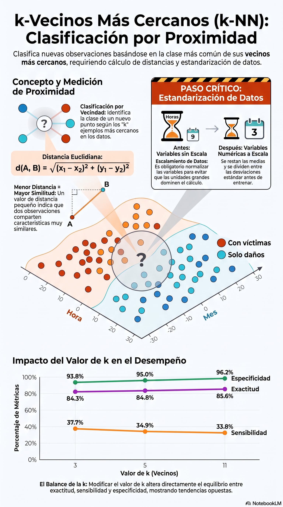

# k vecinos más cercanos, k-NN

::: {.callout-note title="Conexión con el volumen teórico"}
La formulación matemática de distancias, escalamiento y vecinos más cercanos se desarrolla con mayor profundidad en los capítulos 2 y 12 de *Fundamentos Matemáticos del Aprendizaje Automático* [@rodriguez2026fundamentos].
:::

## Objetivos del capítulo

Al finalizar este capítulo, el lector será capaz de:

- explicar la lógica de clasificación de k-NN;
- calcular e interpretar la distancia euclidiana;
- preparar variables numéricas y categóricas para un método basado en distancias;
- evitar fuga de información durante el escalamiento;
- separar entrenamiento, validación y prueba de forma estratificada;
- seleccionar $k$ con validación y reservar la prueba para la evaluación final;
- interpretar exactitud, sensibilidad, especificidad y exactitud balanceada;
- reconocer el efecto del desbalance y de la dimensionalidad sobre k-NN.

## Idea intuitiva

k-NN (*k-nearest neighbors*) clasifica una nueva observación según la clase más frecuente entre sus $k$ vecinos más cercanos [@fix1951discriminatory; @cover1967nearest]. Es un método llamado **perezoso** (*lazy learner*): no estima una ecuación paramétrica durante el entrenamiento; conserva los datos y realiza gran parte del trabajo cuando llega una observación nueva.

```{r ejemplo-knn, fig.width=7, fig.height=4.5}
library(ggplot2)
library(class)
library(dplyr)
library(tidyr)
library(readr)
source("util_graficas.R")

datos_ejemplo <- data.frame(
  hora = c(8, 9, 10, 18, 19, 20, 22, 23),
  mes = c(1, 1, 2, 6, 6, 7, 12, 12),
  clase = c(
    "Solo daños", "Solo daños", "Solo daños",
    "Con víctimas", "Con víctimas", "Con víctimas",
    "Con víctimas", "Con víctimas"
  )
)

ggplot(datos_ejemplo, aes(x = hora, y = mes, color = clase)) +
  geom_point(size = 4) +
  escala_clases_color() +
  labs(
    title = "Ejemplo intuitivo de k-NN",
    subtitle = "La clasificación depende de los vecinos más próximos",
    x = "Hora",
    y = "Mes",
    color = "Clase"
  ) +
  tema_libro()
```

## Distancia euclidiana

Para dos puntos en dos dimensiones,

$$
d(A,B)=\sqrt{(x_1-x_2)^2+(y_1-y_2)^2}.
$$

Con $p$ predictores,

$$
d(\mathbf{x},\mathbf{x}')=
\sqrt{\sum_{j=1}^{p}(x_j-x'_j)^2}.
$$

```{r distancia-knn}
sqrt((8 - 10)^2 + (1 - 2)^2)
```

::: {.callout-tip title="Interpretación"}
Una distancia menor indica mayor proximidad en el espacio de predictores. Esa proximidad solo es significativa si las variables fueron representadas y escaladas de manera razonable.
:::

## ¿Por qué importa el escalamiento?

Si una variable varía entre 0 y 1000 y otra entre 0 y 1, la primera puede dominar la distancia aunque no sea más importante. Para una variable numérica continua puede utilizarse

$$
z_{ij}=\frac{x_{ij}-\bar{x}_{j,\text{train}}}{s_{j,\text{train}}}.
$$

::: {.callout-important title="Evitar fuga de información"}
La media y la desviación utilizadas para transformar validación y prueba deben calcularse **solo con entrenamiento**. Usar todos los datos antes de separar los conjuntos introduce información de prueba en el proceso de construcción del modelo.
:::

En este capítulo las variables categóricas se transforman en indicadores 0/1 mediante `model.matrix()`. La hora, que es continua, sí se estandariza. Conservamos los indicadores binarios en 0/1 para no aumentar artificialmente el peso de categorías poco frecuentes al dividirlas por desviaciones muy pequeñas.

## Funciones auxiliares para una evaluación rigurosa

```{r funciones-auxiliares-knn}
partir_estratificado <- function(y, prop_train = 0.60, prop_val = 0.20, semilla = 2026) {
  set.seed(semilla)
  y <- factor(y)

  idx_train <- integer(0)
  idx_val <- integer(0)
  idx_test <- integer(0)

  for (clase in levels(y)) {
    ids <- sample(which(y == clase))
    n_train <- floor(prop_train * length(ids))
    n_val <- floor(prop_val * length(ids))

    ids_train <- ids[seq_len(n_train)]
    restantes <- ids[-seq_len(n_train)]
    ids_val <- restantes[seq_len(n_val)]
    ids_test <- setdiff(restantes, ids_val)

    idx_train <- c(idx_train, ids_train)
    idx_val <- c(idx_val, ids_val)
    idx_test <- c(idx_test, ids_test)
  }

  list(
    train = sort(idx_train),
    validation = sort(idx_val),
    test = sort(idx_test)
  )
}

metricas_binarias <- function(real, predicho, positiva, negativa) {
  real <- factor(real, levels = c(positiva, negativa))
  predicho <- factor(predicho, levels = c(positiva, negativa))
  m <- table(Real = real, Predicho = predicho)

  VP <- m[positiva, positiva]
  FN <- m[positiva, negativa]
  FP <- m[negativa, positiva]
  VN <- m[negativa, negativa]

  dividir <- function(a, b) if (b == 0) NA_real_ else a / b

  sensibilidad <- dividir(VP, VP + FN)
  especificidad <- dividir(VN, VN + FP)

  data.frame(
    exactitud = dividir(VP + VN, sum(m)),
    sensibilidad = sensibilidad,
    especificidad = especificidad,
    exactitud_balanceada = mean(c(sensibilidad, especificidad), na.rm = TRUE)
  )
}
```

# Caso aplicado A: ATUS

## Cargar y preparar la base

Para mantener tiempos razonables de ejecución, trabajamos con una muestra reproducible de hasta 12 000 accidentes. La muestra sirve para enseñar el algoritmo; no pretende reemplazar un análisis exhaustivo de toda la base.

```{r cargar-preparar-knn}
ruta_atus_ml <- "datos/atus_ml_preparado.csv"

if (!file.exists(ruta_atus_ml)) {
  stop("No se encontró datos/atus_ml_preparado.csv. Ejecute primero el capítulo 2.")
}

atus_ml <- read_csv(ruta_atus_ml, show_col_types = FALSE)

set.seed(2026)
atus_knn_base <- atus_ml |>
  mutate(
    accidente_con_victimas = factor(
      accidente_con_victimas,
      levels = c("Con víctimas", "Solo daños")
    ),
    MES = as.factor(MES),
    ID_HORA_NUM = suppressWarnings(as.numeric(ID_HORA)),
    ID_HORA_NUM = ifelse(
      ID_HORA_NUM >= 0 & ID_HORA_NUM <= 23,
      ID_HORA_NUM,
      NA_real_
    ),
    DIASEMANA = as.factor(DIASEMANA),
    TIPACCID = as.factor(TIPACCID),
    CAUSAACCI = as.factor(CAUSAACCI)
  ) |>
  drop_na(
    accidente_con_victimas,
    MES,
    ID_HORA_NUM,
    DIASEMANA,
    TIPACCID,
    CAUSAACCI
  )

atus_knn_base <- atus_knn_base |>
  slice_sample(n = min(12000, nrow(atus_knn_base)))

prop.table(table(atus_knn_base$accidente_con_victimas))
```

## Construir la matriz de predictores

```{r matriz-predictoras-knn}
matriz_predictoras <- model.matrix(
  ~ ID_HORA_NUM + MES + DIASEMANA + TIPACCID + CAUSAACCI - 1,
  data = atus_knn_base
)

y_atus <- atus_knn_base$accidente_con_victimas

dim(matriz_predictoras)
```

::: {.callout-note title="Variables dummy y dimensionalidad"}
Cada variable categórica genera varias columnas indicadoras. Esto aumenta la dimensión del espacio. En dimensiones altas, las distancias tienden a parecerse entre sí y k-NN puede perder capacidad de distinguir vecinos realmente cercanos; este fenómeno forma parte de la llamada **maldición de la dimensionalidad**.
:::

## Entrenamiento, validación y prueba

```{r particion-knn-atus}
partes_atus <- partir_estratificado(
  y_atus,
  prop_train = 0.60,
  prop_val = 0.20,
  semilla = 2026
)

x_train <- matriz_predictoras[partes_atus$train, , drop = FALSE]
x_val <- matriz_predictoras[partes_atus$validation, , drop = FALSE]
x_test <- matriz_predictoras[partes_atus$test, , drop = FALSE]

y_train <- y_atus[partes_atus$train]
y_val <- y_atus[partes_atus$validation]
y_test <- y_atus[partes_atus$test]

rbind(
  entrenamiento = prop.table(table(y_train)),
  validacion = prop.table(table(y_val)),
  prueba = prop.table(table(y_test))
)
```

## Estandarizar la variable continua con entrenamiento

```{r escalamiento-knn-atus}
media_hora <- mean(x_train[, "ID_HORA_NUM"])
desv_hora <- sd(x_train[, "ID_HORA_NUM"])
if (desv_hora == 0) desv_hora <- 1

x_train_z <- x_train
x_val_z <- x_val
x_test_z <- x_test

x_train_z[, "ID_HORA_NUM"] <-
  (x_train[, "ID_HORA_NUM"] - media_hora) / desv_hora
x_val_z[, "ID_HORA_NUM"] <-
  (x_val[, "ID_HORA_NUM"] - media_hora) / desv_hora
x_test_z[, "ID_HORA_NUM"] <-
  (x_test[, "ID_HORA_NUM"] - media_hora) / desv_hora
```

## Seleccionar el valor de k con validación

El conjunto de prueba no debe utilizarse para elegir hiperparámetros. Comparamos varios valores impares de $k$ en **validación** y seleccionamos el que maximiza la exactitud balanceada.

```{r seleccion-k-atus}
valores_k <- c(3, 5, 7, 11, 15, 21)

resultados_validacion <- do.call(
  rbind,
  lapply(valores_k, function(k_actual) {
    pred <- knn(
      train = x_train_z,
      test = x_val_z,
      cl = y_train,
      k = k_actual
    )

    m <- metricas_binarias(
      y_val,
      pred,
      positiva = "Con víctimas",
      negativa = "Solo daños"
    )
    m$k <- k_actual
    m
  })
) |>
  select(k, exactitud, sensibilidad, especificidad, exactitud_balanceada)

resultados_validacion

k_optimo <- resultados_validacion$k[
  which.max(resultados_validacion$exactitud_balanceada)
]

k_optimo
```

```{r grafica-seleccion-k-atus, fig.width=7, fig.height=4.8}
resultados_largos <- resultados_validacion |>
  pivot_longer(
    cols = c(exactitud, sensibilidad, especificidad, exactitud_balanceada),
    names_to = "metrica",
    values_to = "valor"
  )

ggplot(
  resultados_largos,
  aes(x = k, y = valor, color = metrica, group = metrica)
) +
  geom_line(linewidth = 1.05) +
  geom_point(size = 2.8) +
  scale_color_manual(
    values = c(
      exactitud = col_azul,
      sensibilidad = col_coral,
      especificidad = col_turquesa,
      exactitud_balanceada = col_morado
    )
  ) +
  labs(
    title = "Selección de k en el conjunto de validación",
    subtitle = "La prueba permanece intacta hasta la evaluación final",
    x = "Valor de k",
    y = "Métrica",
    color = "Métrica"
  ) +
  tema_libro()
```

## Evaluación final en prueba

Una vez elegido $k$, se combinan entrenamiento y validación como conjunto de referencia y se evalúa **una sola vez** sobre prueba.

```{r evaluacion-final-knn-atus}
x_ref <- rbind(x_train_z, x_val_z)
y_ref <- factor(
  c(as.character(y_train), as.character(y_val)),
  levels = levels(y_atus)
)

pred_test_atus <- knn(
  train = x_ref,
  test = x_test_z,
  cl = y_ref,
  k = k_optimo
)

matriz_test_atus <- table(
  Real = factor(y_test, levels = c("Con víctimas", "Solo daños")),
  Predicho = factor(pred_test_atus, levels = c("Con víctimas", "Solo daños"))
)

matriz_test_atus

metricas_test_atus <- metricas_binarias(
  y_test,
  pred_test_atus,
  positiva = "Con víctimas",
  negativa = "Solo daños"
)

metricas_test_atus
```

::: {.callout-tip title="Por qué usar exactitud balanceada"}
Cuando una clase es mucho más frecuente, la exactitud global puede favorecer al grupo mayoritario. La exactitud balanceada promedia sensibilidad y especificidad y da el mismo peso a ambas clases.
:::

# Laboratorio interactivo: k-NN

::: {.content-visible when-format="html"}
Seleccione el número de vecinos y mueva una observación nueva. El laboratorio muestra cuáles puntos participan en la decisión y cómo votan.

```{shinylive-r}
#| standalone: true
#| viewerHeight: 760
#| components: [viewer]

library(shiny)

ui <- fluidPage(
  titlePanel("Laboratorio de clasificación k-NN"),
  sidebarLayout(
    sidebarPanel(
      sliderInput("k", "Número de vecinos k", 1, 15, 5, step = 2),
      sliderInput("xnew", "Longitud del sépalo", 4, 8, 5.8, step = 0.1),
      sliderInput("ynew", "Anchura del sépalo", 2, 4.5, 3.0, step = 0.1)
    ),
    mainPanel(
      plotOutput("grafica", height = "500px"),
      verbatimTextOutput("resultado"),
      textOutput("explicacion")
    )
  )
)

server <- function(input, output, session) {
  resultado <- reactive({
    X <- as.matrix(iris[, c("Sepal.Length", "Sepal.Width")])
    nuevo <- c(input$xnew, input$ynew)

    distancias <- sqrt(rowSums(sweep(X, 2, nuevo, "-")^2))
    indices <- order(distancias)[seq_len(input$k)]
    votos <- table(iris$Species[indices])
    clase <- names(which.max(votos))

    list(indices = indices, votos = votos, clase = clase)
  })

  output$grafica <- renderPlot({
    r <- resultado()
    especies <- as.integer(iris$Species)

    plot(
      iris$Sepal.Length,
      iris$Sepal.Width,
      pch = 19,
      col = especies,
      xlab = "Longitud del sépalo",
      ylab = "Anchura del sépalo",
      main = paste("Predicción:", r$clase)
    )

    points(
      iris$Sepal.Length[r$indices],
      iris$Sepal.Width[r$indices],
      pch = 1,
      cex = 2.1,
      lwd = 2
    )

    points(input$xnew, input$ynew, pch = 8, cex = 2.2, lwd = 3)

    segments(
      input$xnew,
      input$ynew,
      iris$Sepal.Length[r$indices],
      iris$Sepal.Width[r$indices],
      lty = 3
    )

    legend(
      "topright",
      legend = levels(iris$Species),
      col = seq_along(levels(iris$Species)),
      pch = 19,
      bty = "n"
    )
  })

  output$resultado <- renderPrint({
    r <- resultado()
    cat("Clase predicha:", r$clase, "\n\n")
    cat("Votos de los vecinos:\n")
    print(r$votos)
  })

  output$explicacion <- renderText({
    paste0(
      "Los círculos grandes indican los ", input$k,
      " vecinos utilizados. La estrella representa la observación nueva."
    )
  })
}

shinyApp(ui, server)
```
:::

::: {.content-visible when-format="pdf"}
### Laboratorio disponible en la versión web
El lector puede cambiar $k$, mover una observación nueva y visualizar los vecinos que determinan la clase predicha.
:::

# Caso aplicado B: k-NN con COVID-19

Utilizamos el mismo criterio reproducible de selección de periodo introducido en los capítulos 2, 3 y 5. El objetivo es clasificar el desenlace administrativo `MURIO` con fines exclusivamente didácticos.

```{r covid-knn-seleccionar-periodo}
conteo_covid <- read_csv(
  "datos/covid19/procesados/conteo_casos_confirmados_2020_2025.csv",
  show_col_types = FALSE
)

anio_covid <- conteo_covid |>
  filter(ESTADO == "PROCESADO", !is.na(CASOS_CONFIRMADOS)) |>
  slice_max(CASOS_CONFIRMADOS, n = 1, with_ties = FALSE) |>
  pull(ANIO)

ruta_covid <- file.path(
  "datos/covid19/procesados",
  paste0("covid19_mexico_", anio_covid, "_ml_preparado.csv.gz")
)

if (!file.exists(ruta_covid)) {
  stop("No se encontró la base COVID-19 seleccionada por el procedimiento reproducible.")
}

message("Periodo COVID-19 utilizado: ", anio_covid)
```

## Preparar una muestra educativa

```{r covid-knn-preparar}
covid_knn <- read_csv(ruta_covid, show_col_types = FALSE) |>
  select(
    MURIO,
    EDAD,
    NEUMONIA,
    DIABETES,
    HIPERTENSION,
    OBESIDAD,
    RENAL_CRONICA,
    NUM_COMORBILIDADES
  ) |>
  drop_na() |>
  mutate(
    MURIO = factor(
      MURIO,
      levels = c(1, 0),
      labels = c("Defunción", "Sin defunción")
    )
  )

set.seed(2026)
covid_knn <- covid_knn |>
  slice_sample(n = min(12000, nrow(covid_knn)))

X_covid <- covid_knn |>
  select(-MURIO) |>
  as.matrix()
y_covid <- covid_knn$MURIO
```

::: {.callout-warning title="Uso exclusivamente educativo"}
Este ejercicio estudia el comportamiento de k-NN. No es una calculadora clínica, un instrumento diagnóstico ni un modelo pronóstico validado. Si la muestra modifica la prevalencia de las clases, sus proporciones tampoco representan tasas poblacionales.
:::

## Partición y escalamiento COVID-19

Las variables `EDAD` y `NUM_COMORBILIDADES` son continuas o de conteo y se estandarizan. Las variables clínicas binarias permanecen codificadas como 0/1.

```{r covid-knn-particion-escalamiento}
partes_covid <- partir_estratificado(
  y_covid,
  prop_train = 0.60,
  prop_val = 0.20,
  semilla = 2026
)

xc_train <- X_covid[partes_covid$train, , drop = FALSE]
xc_val <- X_covid[partes_covid$validation, , drop = FALSE]
xc_test <- X_covid[partes_covid$test, , drop = FALSE]

yc_train <- y_covid[partes_covid$train]
yc_val <- y_covid[partes_covid$validation]
yc_test <- y_covid[partes_covid$test]

continuas <- intersect(c("EDAD", "NUM_COMORBILIDADES"), colnames(xc_train))

xc_train_z <- xc_train
xc_val_z <- xc_val
xc_test_z <- xc_test

for (variable in continuas) {
  media <- mean(xc_train[, variable])
  desv <- sd(xc_train[, variable])
  if (desv == 0) desv <- 1

  xc_train_z[, variable] <- (xc_train[, variable] - media) / desv
  xc_val_z[, variable] <- (xc_val[, variable] - media) / desv
  xc_test_z[, variable] <- (xc_test[, variable] - media) / desv
}
```

## Seleccionar k y evaluar una sola vez en prueba

```{r covid-knn-seleccionar-k}
valores_k_covid <- c(3, 5, 7, 11, 15, 21)

resultados_covid_val <- do.call(
  rbind,
  lapply(valores_k_covid, function(k_actual) {
    p <- knn(xc_train_z, xc_val_z, yc_train, k = k_actual)
    m <- metricas_binarias(
      yc_val,
      p,
      positiva = "Defunción",
      negativa = "Sin defunción"
    )
    m$k <- k_actual
    m
  })
) |>
  select(k, exactitud, sensibilidad, especificidad, exactitud_balanceada)

resultados_covid_val

k_covid <- resultados_covid_val$k[
  which.max(resultados_covid_val$exactitud_balanceada)
]

k_covid
```

```{r covid-knn-evaluacion-final}
xc_ref <- rbind(xc_train_z, xc_val_z)
yc_ref <- factor(
  c(as.character(yc_train), as.character(yc_val)),
  levels = levels(y_covid)
)

pred_covid_test <- knn(
  train = xc_ref,
  test = xc_test_z,
  cl = yc_ref,
  k = k_covid
)

matriz_covid_knn <- table(
  Real = factor(yc_test, levels = c("Defunción", "Sin defunción")),
  Predicho = factor(pred_covid_test, levels = c("Defunción", "Sin defunción"))
)

matriz_covid_knn

metricas_binarias(
  yc_test,
  pred_covid_test,
  positiva = "Defunción",
  negativa = "Sin defunción"
)
```

## ¿Cómo interpretar k?

Valores pequeños de $k$ producen fronteras muy locales y pueden reaccionar al ruido. Valores grandes suavizan la decisión y pueden borrar estructuras locales. El mejor valor depende de los datos y debe seleccionarse con entrenamiento/validación o validación cruzada, **nunca ajustándolo repetidamente sobre el conjunto de prueba**.

## Materiales complementarios del capítulo

| Recurso | Utilidad | Abrir o reproducir | Descargar |
|---|---|---|---|
| Video explicativo | Explicación audiovisual de k-NN, distancia, escalamiento y elección de k. | [Ver en YouTube](https://www.youtube.com/watch?v=NLJj0QAWomU){target="_blank"} | — |
| Presentación en PDF | Diapositivas para lectura, estudio o exposición. | [Ver PDF](recursos/capitulo-06/capitulo-06-knn-presentacion.pdf){target="_blank"} | [Descargar PDF](recursos/capitulo-06/capitulo-06-knn-presentacion.pdf){download="capitulo-06-knn-presentacion.pdf"} |
| Presentación editable | Archivo PowerPoint para utilizarlo en clase o adaptarlo. | [Abrir PPTX](recursos/capitulo-06/capitulo-06-knn-presentacion.pptx) | [Descargar PPTX](recursos/capitulo-06/capitulo-06-knn-presentacion.pptx){download="capitulo-06-knn-presentacion.pptx"} |
| Infografía | Resumen visual de las ideas fundamentales. | [Ver infografía](recursos/capitulo-06/capitulo-06-knn-infografia.png){target="_blank"} | [Descargar PNG](recursos/capitulo-06/capitulo-06-knn-infografia.png){download="capitulo-06-knn-infografia.png"} |
| Cuaderno Google Colab | Cuaderno autónomo para ejecutar los ejemplos del capítulo. | [Abrir en Google Colab](https://colab.research.google.com/github/gilbertorodriguez59/libro-machine-learning-r/blob/main/colab/06-knn.ipynb){target="_blank"} | — |

::: {.content-visible when-format="html"}
### Video explicativo

<div class="video-responsive">
  <iframe
    src="https://www.youtube.com/embed/NLJj0QAWomU"
    title="Capítulo 6. k vecinos más cercanos, k-NN"
    frameborder="0"
    allow="accelerometer; autoplay; clipboard-write; encrypted-media; gyroscope; picture-in-picture; web-share"
    referrerpolicy="strict-origin-when-cross-origin"
    allowfullscreen>
  </iframe>
</div>

### Vista previa de la infografía

[](recursos/capitulo-06/capitulo-06-knn-infografia.png)
:::

::: {.content-visible when-format="pdf"}
**Video del capítulo:** <https://www.youtube.com/watch?v=NLJj0QAWomU>

La presentación PDF, el archivo editable, la infografía y el cuaderno Colab pueden consultarse desde la versión web del libro.
:::

::: {.callout-note title="Elaboración de los materiales"}
Los materiales complementarios fueron elaborados con apoyo de **NotebookLM de Google**, a partir del contenido del capítulo, y posteriormente revisados y adaptados por el autor. El texto del libro y sus archivos fuente constituyen la referencia principal.
:::

## Conclusión

k-NN es sencillo de explicar, pero exige disciplina en la preparación: representación adecuada de variables, escalamiento sin fuga de información, separación de conjuntos y selección de $k$ fuera de la prueba final. Su desempeño también puede deteriorarse con muchas dimensiones o fuerte desbalance, por lo que las métricas y el diseño de validación forman parte esencial del método.
