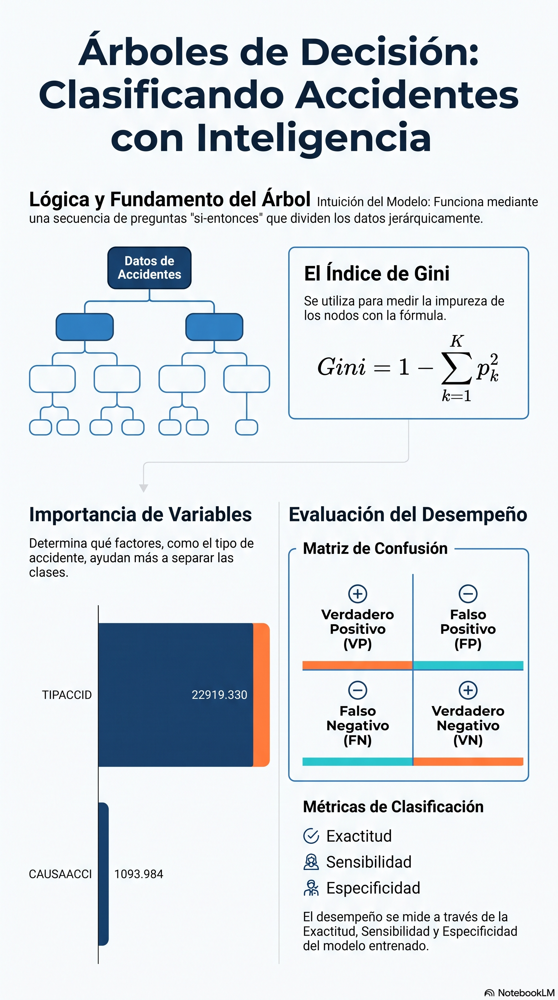

# Árboles de decisión para clasificación

::: {.callout-note title="Conexión con el volumen teórico"}
La formulación matemática de entropía, impureza, particiones y árboles de decisión se desarrolla con mayor profundidad en los capítulos 3, 6 y 13 de *Fundamentos Matemáticos del Aprendizaje Automático* [@rodriguez2026fundamentos].
:::

## Objetivos del capítulo

Al finalizar este capítulo, el lector será capaz de:

- explicar cómo un árbol divide recursivamente el espacio de predictores;
- calcular e interpretar la impureza de Gini;
- distinguir crecimiento, control de complejidad y poda;
- seleccionar la complejidad mediante validación cruzada dentro del entrenamiento;
- interpretar reglas e importancia de variables sin confundir predicción con causalidad;
- evaluar un árbol mediante matriz de confusión, sensibilidad, especificidad y exactitud balanceada;
- aplicar el método a ATUS y a una ruta educativa de COVID-19.

## Idea básica

Un árbol de decisión clasifica observaciones mediante una secuencia de preguntas tipo **si-entonces**. Cada nodo interno selecciona una variable y un punto de corte —o una partición de categorías— para formar nodos hijos más homogéneos [@breiman1984classification].

A diferencia de k-NN, un árbol no necesita estandarizar las variables: las decisiones se basan en cortes de cada predictor, no en una distancia euclidiana común.

## Impureza de Gini

Una medida habitual de impureza es

$$
Gini(t)=1-\sum_{k=1}^{K}p_{k,t}^2,
$$

donde $p_{k,t}$ es la proporción de observaciones de la clase $k$ en el nodo $t$.

Para dos clases con proporciones $p$ y $1-p$,

$$
Gini=1-p^2-(1-p)^2.
$$

```{r ejemplo-gini-arbol}
gini <- function(clase) {
  p <- prop.table(table(clase))
  1 - sum(p^2)
}

gini(c("A", "A", "A", "B", "B"))
gini(c("A", "A", "A", "A", "A"))
```

::: {.callout-tip title="Interpretación"}
Un nodo puro tiene Gini igual a 0. Una división es útil cuando reduce la impureza ponderada de los nodos hijos respecto del nodo padre.
:::

## Entropía e información

Otra familia de árboles utiliza entropía,

$$
H(t)=-\sum_{k=1}^{K}p_{k,t}\log_2(p_{k,t}),
$$

y busca divisiones con alta ganancia de información. ID3 y sus extensiones popularizaron este enfoque [@quinlan1986induction]. En este capítulo utilizamos CART mediante `rpart`, cuyo criterio predeterminado de clasificación se relaciona con la impureza de Gini.

## Sobreajuste y poda

Un árbol muy profundo puede memorizar peculiaridades del entrenamiento. CART permite crecer un árbol y después **podarlo** utilizando el parámetro de complejidad `cp`.

::: {.callout-important title="La prueba no se usa para podar"}
La complejidad se seleccionará mediante la validación cruzada interna de `rpart` sobre el conjunto de entrenamiento. El conjunto de prueba permanecerá intacto hasta la evaluación final.
:::

## Funciones auxiliares

```{r funciones-auxiliares-arbol}
library(readr)
library(dplyr)
library(tidyr)
library(rpart)
source("util_graficas.R")

partir_train_test_estratificado <- function(y, prop_train = 0.80, semilla = 2026) {
  set.seed(semilla)
  y <- factor(y)
  idx_train <- integer(0)

  for (clase in levels(y)) {
    ids <- sample(which(y == clase))
    n_train <- floor(prop_train * length(ids))
    idx_train <- c(idx_train, ids[seq_len(n_train)])
  }

  idx_train <- sort(idx_train)
  list(
    train = idx_train,
    test = setdiff(seq_along(y), idx_train)
  )
}

metricas_arbol <- function(real, predicho, positiva, negativa) {
  real <- factor(real, levels = c(positiva, negativa))
  predicho <- factor(predicho, levels = c(positiva, negativa))
  m <- table(Real = real, Predicho = predicho)

  VP <- m[positiva, positiva]
  FN <- m[positiva, negativa]
  FP <- m[negativa, positiva]
  VN <- m[negativa, negativa]

  dividir <- function(a, b) if (b == 0) NA_real_ else a / b
  sensibilidad <- dividir(VP, VP + FN)
  especificidad <- dividir(VN, VN + FP)

  list(
    matriz = m,
    metricas = data.frame(
      exactitud = dividir(VP + VN, sum(m)),
      sensibilidad = sensibilidad,
      especificidad = especificidad,
      exactitud_balanceada = mean(c(sensibilidad, especificidad), na.rm = TRUE)
    )
  )
}
```

# Caso aplicado A: ATUS

## Cargar y preparar datos

Para que el render del libro sea reproducible y razonablemente rápido, se utiliza una muestra de hasta 20 000 registros. En un proyecto aplicado puede emplearse la base completa si se dispone de los recursos de cómputo necesarios.

```{r preparar-arbol-atus}
ruta_atus_ml <- "datos/atus_ml_preparado.csv"

if (!file.exists(ruta_atus_ml)) {
  stop("No se encontró datos/atus_ml_preparado.csv. Ejecute primero el capítulo 2.")
}

atus_ml <- read_csv(ruta_atus_ml, show_col_types = FALSE)

set.seed(2026)
atus_arbol_base <- atus_ml |>
  mutate(
    accidente_con_victimas = factor(
      accidente_con_victimas,
      levels = c("Con víctimas", "Solo daños")
    ),
    MES = as.factor(MES),
    ID_HORA_NUM = suppressWarnings(as.numeric(ID_HORA)),
    ID_HORA_NUM = ifelse(
      ID_HORA_NUM >= 0 & ID_HORA_NUM <= 23,
      ID_HORA_NUM,
      NA_real_
    ),
    DIASEMANA = as.factor(DIASEMANA),
    TIPACCID = as.factor(TIPACCID),
    CAUSAACCI = as.factor(CAUSAACCI)
  ) |>
  drop_na(
    accidente_con_victimas,
    MES,
    ID_HORA_NUM,
    DIASEMANA,
    TIPACCID,
    CAUSAACCI
  ) |>
  slice_sample(n = min(20000, n()))

data.frame(
  filas = nrow(atus_arbol_base),
  columnas = ncol(atus_arbol_base)
)
```

## División estratificada entrenamiento-prueba

```{r dividir-arbol-atus}
partes_atus <- partir_train_test_estratificado(
  atus_arbol_base$accidente_con_victimas,
  prop_train = 0.80,
  semilla = 2026
)

entrenamiento <- atus_arbol_base[partes_atus$train, ]
prueba <- atus_arbol_base[partes_atus$test, ]

rbind(
  entrenamiento = prop.table(table(entrenamiento$accidente_con_victimas)),
  prueba = prop.table(table(prueba$accidente_con_victimas))
)
```

## Crecer un árbol y seleccionar complejidad

Se permite inicialmente un árbol relativamente flexible. La tabla de complejidad utiliza validación cruzada interna para estimar `xerror`.

```{r entrenar-arbol-atus}
set.seed(2026)

arbol_grande <- rpart(
  accidente_con_victimas ~
    MES + ID_HORA_NUM + DIASEMANA + TIPACCID + CAUSAACCI,
  data = entrenamiento,
  method = "class",
  control = rpart.control(
    cp = 0.0005,
    minsplit = 120,
    minbucket = 40,
    maxdepth = 10,
    xval = 10
  )
)

printcp(arbol_grande)
```

## Poda mediante error de validación cruzada

```{r podar-arbol-atus}
tabla_cp <- arbol_grande$cptable
fila_optima <- which.min(tabla_cp[, "xerror"])
cp_optimo <- tabla_cp[fila_optima, "CP"]

modelo_arbol <- prune(
  arbol_grande,
  cp = cp_optimo
)

cp_optimo
```

::: {.callout-note title="Regla 1-SE"}
Una alternativa más conservadora consiste en elegir el árbol más pequeño cuyo error esté dentro de un error estándar del mínimo. Esa regla suele favorecer modelos más simples. Aquí usamos el mínimo `xerror` para mantener transparente el procedimiento, pero conviene comparar ambas estrategias en proyectos formales.
:::

## Complejidad final e importancia de variables

```{r importancia-arbol-atus}
importancia <- modelo_arbol$variable.importance

if (!is.null(importancia)) {
  importancia_df <- data.frame(
    variable = names(importancia),
    importancia = as.numeric(importancia),
    row.names = NULL
  ) |>
    arrange(desc(importancia))

  importancia_df
}
```

::: {.callout-warning title="Importancia predictiva no es causalidad"}
Una variable puede ser muy útil para producir divisiones sin ser causa del desenlace. La importancia describe el árbol ajustado y puede además favorecer predictores con muchas posibilidades de corte.
:::

## Visualización opcional del árbol

```{r grafica-arbol-opcional, eval=FALSE}
plot(modelo_arbol, uniform = TRUE, margin = 0.1)
text(modelo_arbol, use.n = TRUE, cex = 0.7)
```

La figura se deja como código opcional porque árboles con muchos nodos pueden resultar ilegibles en una página PDF.

## Evaluación final en prueba

```{r evaluar-arbol-atus}
pred_arbol <- predict(
  modelo_arbol,
  newdata = prueba,
  type = "class"
)

resultado_atus <- metricas_arbol(
  prueba$accidente_con_victimas,
  pred_arbol,
  positiva = "Con víctimas",
  negativa = "Solo daños"
)

resultado_atus$matriz
resultado_atus$metricas
```

::: {.callout-tip title="Interpretación"}
Si existe desbalance, la exactitud global debe leerse junto con sensibilidad, especificidad y exactitud balanceada. Un árbol que predice casi siempre la clase mayoritaria puede parecer preciso y, sin embargo, detectar mal la clase minoritaria.
:::

# Laboratorio interactivo: construye una división CART

::: {.content-visible when-format="html"}
Cambie la variable y el punto de corte para observar cómo una regla divide `iris` y cuánto disminuye la impureza de Gini.

```{shinylive-r}
#| standalone: true
#| viewerHeight: 720
#| components: [viewer]

library(shiny)

gini_lab <- function(clase) {
  if (length(clase) == 0) return(0)
  p <- prop.table(table(clase))
  1 - sum(p^2)
}

ui <- fluidPage(
  titlePanel("Explorador interactivo de una división CART"),
  sidebarLayout(
    sidebarPanel(
      selectInput(
        "variable",
        "Variable para dividir",
        choices = c(
          "Longitud del pétalo" = "Petal.Length",
          "Anchura del pétalo" = "Petal.Width",
          "Longitud del sépalo" = "Sepal.Length",
          "Anchura del sépalo" = "Sepal.Width"
        ),
        selected = "Petal.Length"
      ),
      uiOutput("control_corte")
    ),
    mainPanel(
      plotOutput("grafica", height = "420px"),
      tableOutput("resumen"),
      textOutput("interpretacion")
    )
  )
)

server <- function(input, output, session) {
  output$control_corte <- renderUI({
    x <- iris[[input$variable]]
    sliderInput(
      "corte",
      "Punto de corte",
      min = floor(min(x) * 10) / 10,
      max = ceiling(max(x) * 10) / 10,
      value = median(x),
      step = 0.1
    )
  })

  division <- reactive({
    req(input$corte)
    x <- iris[[input$variable]]
    izquierda <- x <= input$corte
    derecha <- !izquierda

    gini_padre <- gini_lab(iris$Species)
    gini_izq <- gini_lab(iris$Species[izquierda])
    gini_der <- gini_lab(iris$Species[derecha])
    n <- nrow(iris)

    gini_ponderado <-
      sum(izquierda) / n * gini_izq +
      sum(derecha) / n * gini_der

    list(
      x = x,
      izquierda = izquierda,
      derecha = derecha,
      gini_padre = gini_padre,
      gini_izq = gini_izq,
      gini_der = gini_der,
      gini_ponderado = gini_ponderado,
      ganancia = gini_padre - gini_ponderado
    )
  })

  output$grafica <- renderPlot({
    d <- division()
    colores <- as.integer(iris$Species)

    plot(
      d$x,
      jitter(as.integer(iris$Species), amount = 0.08),
      pch = 19,
      col = colores,
      xlab = input$variable,
      ylab = "Especie",
      yaxt = "n",
      main = "División propuesta"
    )
    axis(2, at = 1:3, labels = levels(iris$Species))
    abline(v = input$corte, lwd = 3, lty = 2)
  })

  output$resumen <- renderTable({
    d <- division()
    data.frame(
      Nodo = c("Padre", "Izquierdo", "Derecho", "División ponderada"),
      Observaciones = c(
        nrow(iris),
        sum(d$izquierda),
        sum(d$derecha),
        nrow(iris)
      ),
      Gini = round(
        c(d$gini_padre, d$gini_izq, d$gini_der, d$gini_ponderado),
        4
      )
    )
  })

  output$interpretacion <- renderText({
    d <- division()
    paste0(
      "La reducción de impureza es ", round(d$ganancia, 4),
      ". Una reducción mayor indica una división más útil."
    )
  })
}

shinyApp(ui, server)
```
:::

::: {.content-visible when-format="pdf"}
### Laboratorio disponible en la versión web
La versión web permite cambiar la variable y el punto de corte y comparar la impureza antes y después de la división.
:::

# Caso aplicado B: árbol de decisión con COVID-19

Se utiliza el mismo procedimiento reproducible de selección de periodo aplicado en capítulos anteriores.

```{r seleccionar-covid-arbol}
conteo_covid <- read_csv(
  "datos/covid19/procesados/conteo_casos_confirmados_2020_2025.csv",
  show_col_types = FALSE
)

anio_covid <- conteo_covid |>
  filter(ESTADO == "PROCESADO", !is.na(CASOS_CONFIRMADOS)) |>
  slice_max(CASOS_CONFIRMADOS, n = 1, with_ties = FALSE) |>
  pull(ANIO)

ruta_covid <- file.path(
  "datos/covid19/procesados",
  paste0("covid19_mexico_", anio_covid, "_ml_preparado.csv.gz")
)

if (!file.exists(ruta_covid)) {
  stop("No se encontró la base COVID-19 seleccionada por el procedimiento reproducible.")
}
```

## Preparar la muestra y dividirla

```{r preparar-covid-arbol}
covid_arbol <- read_csv(ruta_covid, show_col_types = FALSE) |>
  select(
    MURIO, EDAD, NEUMONIA, DIABETES, HIPERTENSION,
    OBESIDAD, RENAL_CRONICA, NUM_COMORBILIDADES
  ) |>
  drop_na() |>
  mutate(
    MURIO = factor(
      MURIO,
      levels = c(1, 0),
      labels = c("Defunción", "Sin defunción")
    )
  )

set.seed(2026)
covid_arbol <- covid_arbol |>
  slice_sample(n = min(12000, n()))

partes_covid <- partir_train_test_estratificado(
  covid_arbol$MURIO,
  prop_train = 0.80,
  semilla = 2026
)

covid_train <- covid_arbol[partes_covid$train, ]
covid_test <- covid_arbol[partes_covid$test, ]
```

::: {.callout-warning title="Uso exclusivamente educativo"}
Las reglas encontradas describen patrones de esta muestra administrativa. No deben utilizarse como reglas clínicas, diagnósticas o terapéuticas.
:::

## Crecer, podar y evaluar el árbol COVID-19

```{r modelo-covid-arbol}
set.seed(2026)

arbol_covid_grande <- rpart(
  MURIO ~ EDAD + NEUMONIA + DIABETES + HIPERTENSION +
    OBESIDAD + RENAL_CRONICA + NUM_COMORBILIDADES,
  data = covid_train,
  method = "class",
  control = rpart.control(
    cp = 0.0005,
    minsplit = 80,
    minbucket = 30,
    maxdepth = 8,
    xval = 10
  )
)

cp_covid <- arbol_covid_grande$cptable[
  which.min(arbol_covid_grande$cptable[, "xerror"]),
  "CP"
]

arbol_covid <- prune(arbol_covid_grande, cp = cp_covid)
cp_covid
```

```{r metricas-covid-arbol}
pred_covid_arbol <- predict(
  arbol_covid,
  covid_test,
  type = "class"
)

resultado_covid <- metricas_arbol(
  covid_test$MURIO,
  pred_covid_arbol,
  positiva = "Defunción",
  negativa = "Sin defunción"
)

resultado_covid$matriz
resultado_covid$metricas
```

## Materiales complementarios del capítulo

| Recurso | Utilidad | Abrir o reproducir | Descargar |
|---|---|---|---|
| Video explicativo | Explicación audiovisual de árboles, impureza y poda. | [Ver en YouTube](https://www.youtube.com/watch?v=UperQjxBYEY){target="_blank"} | — |
| Presentación en PDF | Diapositivas para lectura, estudio o exposición. | [Ver PDF](recursos/capitulo-07/capitulo-07-arboles-presentacion.pdf){target="_blank"} | [Descargar PDF](recursos/capitulo-07/capitulo-07-arboles-presentacion.pdf){download="capitulo-07-arboles-presentacion.pdf"} |
| Presentación editable | Archivo PowerPoint para utilizarlo en clase o adaptarlo. | [Abrir PPTX](recursos/capitulo-07/capitulo-07-arboles-presentacion.pptx) | [Descargar PPTX](recursos/capitulo-07/capitulo-07-arboles-presentacion.pptx){download="capitulo-07-arboles-presentacion.pptx"} |
| Infografía | Resumen visual de las ideas fundamentales. | [Ver infografía](recursos/capitulo-07/capitulo-07-arboles-infografia.png){target="_blank"} | [Descargar PNG](recursos/capitulo-07/capitulo-07-arboles-infografia.png){download="capitulo-07-arboles-infografia.png"} |
| Cuaderno Google Colab | Cuaderno autónomo para ejecutar los ejemplos del capítulo. | [Abrir en Google Colab](https://colab.research.google.com/github/gilbertorodriguez59/libro-machine-learning-r/blob/main/colab/07-arboles-decision.ipynb){target="_blank"} | — |

::: {.content-visible when-format="html"}
### Video explicativo

<div class="video-responsive">
  <iframe
    src="https://www.youtube.com/embed/UperQjxBYEY"
    title="Capítulo 7. Árboles de decisión para clasificación"
    frameborder="0"
    allow="accelerometer; autoplay; clipboard-write; encrypted-media; gyroscope; picture-in-picture; web-share"
    referrerpolicy="strict-origin-when-cross-origin"
    allowfullscreen>
  </iframe>
</div>

### Vista previa de la infografía

[](recursos/capitulo-07/capitulo-07-arboles-infografia.png)
:::

::: {.content-visible when-format="pdf"}
**Video del capítulo:** <https://www.youtube.com/watch?v=UperQjxBYEY>

La presentación PDF, el archivo editable, la infografía y el cuaderno Colab pueden consultarse desde la versión web del libro.
:::

::: {.callout-note title="Elaboración de los materiales"}
Los materiales complementarios fueron elaborados con apoyo de **NotebookLM de Google**, a partir del contenido del capítulo, y posteriormente revisados y adaptados por el autor.
:::

## Conclusión

Los árboles de decisión convierten la clasificación en reglas visibles y flexibles. Esa interpretabilidad no evita el sobreajuste: la profundidad y la complejidad deben controlarse mediante entrenamiento y validación cruzada, reservando la prueba para el final. La inestabilidad de un árbol individual motiva el siguiente capítulo: **Random Forest**, que combina muchos árboles para reducir variabilidad.

## Referencias fundamentales

La metodología CART fue sistematizada por @breiman1984classification. La inducción de árboles mediante ganancia de información fue desarrollada por @quinlan1986induction. Una introducción contemporánea con ejemplos estadísticos y de aprendizaje automático puede consultarse en @james2021islr.
