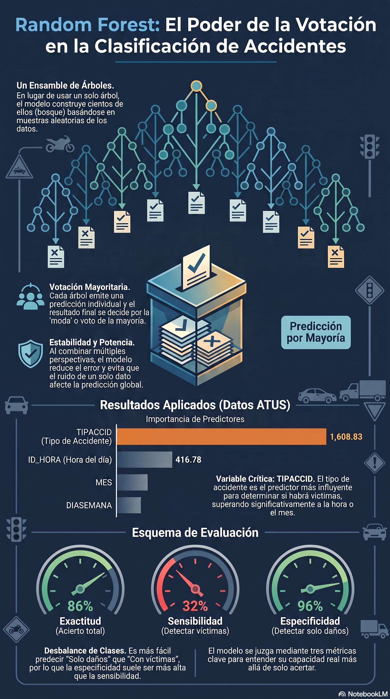

# Random Forest para clasificación

::: {.callout-note title="Conexión con el volumen teórico"}
La formulación matemática de *bootstrap*, ensambles y Random Forest se desarrolla con mayor profundidad en los capítulos 7 y 14 de *Fundamentos Matemáticos del Aprendizaje Automático* [@rodriguez2026fundamentos].
:::

## Objetivos del capítulo

Al finalizar este capítulo, el lector será capaz de:

- explicar cómo Random Forest combina muchos árboles;
- distinguir muestreo *bootstrap*, selección aleatoria de variables y agregación;
- interpretar el papel de `num.trees`, `mtry` y `min.node.size`;
- utilizar el error fuera de bolsa (OOB) para apoyar el ajuste sin tocar la prueba final;
- interpretar el Brier score OOB de un bosque probabilístico;
- comparar importancia por impureza e importancia por permutación;
- evaluar el bosque con matriz de confusión, sensibilidad, especificidad y exactitud balanceada;
- aplicar el método a ATUS y a una ruta educativa de COVID-19.

## Idea central

Random Forest construye muchos árboles parcialmente diferentes y agrega sus predicciones [@breiman2001random]. Para clasificación, una forma de expresar la decisión es

$$
\widehat y(x)=\operatorname{moda}
\left\{
\widehat y^{(1)}(x),\ldots,\widehat y^{(B)}(x)
\right\}.
$$

Dos mecanismos introducen diversidad entre árboles:

1. cada árbol se entrena con una muestra *bootstrap* del conjunto de entrenamiento;
2. en cada división solo se considera un subconjunto aleatorio de predictores.

Al reducir la correlación entre árboles y promediar muchas decisiones, el bosque suele ser más estable que un árbol individual.

## Observaciones fuera de bolsa (OOB)

Una observación que no entra en la muestra *bootstrap* de un árbol es **fuera de bolsa** (*out-of-bag*) para ese árbol. Las predicciones OOB permiten estimar internamente el desempeño con datos no utilizados por cada árbol.

::: {.callout-important title="OOB no reemplaza necesariamente la prueba final"}
El error OOB es muy útil para desarrollar y comparar configuraciones del bosque dentro del entrenamiento. Si se reservó un conjunto de prueba independiente, conviene conservarlo intacto para una evaluación final externa.
:::

En `ranger`, cuando se ajusta un bosque con `probability = TRUE`, `prediction.error` corresponde al **Brier score OOB**. Para un evento binario,

$$
BS=\frac{1}{n}\sum_{i=1}^{n}(p_i-y_i)^2,
$$

donde valores menores indican mejores probabilidades en términos de error cuadrático.

## Funciones auxiliares

```{r funciones-auxiliares-rf}
library(readr)
library(dplyr)
library(tidyr)
library(ggplot2)
library(ranger)
source("util_graficas.R")

partir_rf_estratificado <- function(y, prop_train = 0.80, semilla = 2026) {
  set.seed(semilla)
  y <- factor(y)
  idx_train <- integer(0)

  for (clase in levels(y)) {
    ids <- sample(which(y == clase))
    n_train <- floor(prop_train * length(ids))
    idx_train <- c(idx_train, ids[seq_len(n_train)])
  }

  idx_train <- sort(idx_train)
  list(
    train = idx_train,
    test = setdiff(seq_along(y), idx_train)
  )
}

metricas_rf <- function(real, predicho, positiva, negativa) {
  real <- factor(real, levels = c(positiva, negativa))
  predicho <- factor(predicho, levels = c(positiva, negativa))
  m <- table(Real = real, Predicho = predicho)

  VP <- m[positiva, positiva]
  FN <- m[positiva, negativa]
  FP <- m[negativa, positiva]
  VN <- m[negativa, negativa]

  dividir <- function(a, b) if (b == 0) NA_real_ else a / b
  sensibilidad <- dividir(VP, VP + FN)
  especificidad <- dividir(VN, VN + FP)

  list(
    matriz = m,
    metricas = data.frame(
      exactitud = dividir(VP + VN, sum(m)),
      sensibilidad = sensibilidad,
      especificidad = especificidad,
      exactitud_balanceada = mean(c(sensibilidad, especificidad), na.rm = TRUE)
    )
  )
}
```

# Caso aplicado A: ATUS

## Cargar y preparar una muestra reproducible

```{r preparar-rf-atus}
ruta_atus_ml <- "datos/atus_ml_preparado.csv"

if (!file.exists(ruta_atus_ml)) {
  stop("No se encontró datos/atus_ml_preparado.csv. Ejecute primero el capítulo 2.")
}

atus_ml <- read_csv(ruta_atus_ml, show_col_types = FALSE)

set.seed(2026)
atus_rf_base <- atus_ml |>
  mutate(
    accidente_con_victimas = factor(
      accidente_con_victimas,
      levels = c("Con víctimas", "Solo daños")
    ),
    MES = as.factor(MES),
    ID_HORA_NUM = suppressWarnings(as.numeric(ID_HORA)),
    ID_HORA_NUM = ifelse(
      ID_HORA_NUM >= 0 & ID_HORA_NUM <= 23,
      ID_HORA_NUM,
      NA_real_
    ),
    DIASEMANA = as.factor(DIASEMANA),
    TIPACCID = as.factor(TIPACCID),
    CAUSAACCI = as.factor(CAUSAACCI)
  ) |>
  drop_na(
    accidente_con_victimas,
    MES,
    ID_HORA_NUM,
    DIASEMANA,
    TIPACCID,
    CAUSAACCI
  )

atus_rf_base <- atus_rf_base |>
  slice_sample(n = min(15000, nrow(atus_rf_base)))

data.frame(
  filas = nrow(atus_rf_base),
  columnas = ncol(atus_rf_base)
)
```

```{r distribucion-rf-atus, fig.width=7, fig.height=4.5}
ggplot(
  atus_rf_base,
  aes(x = accidente_con_victimas, fill = accidente_con_victimas)
) +
  geom_bar(width = 0.7) +
  escala_clases_fill() +
  scale_y_continuous(labels = etiqueta_numero) +
  labs(
    title = "Distribución de la variable respuesta",
    subtitle = "Muestra de trabajo para Random Forest",
    x = "Clase",
    y = "Número de accidentes"
  ) +
  tema_libro() +
  theme(legend.position = "none")
```

## División estratificada entrenamiento-prueba

```{r dividir-rf-atus}
partes_atus <- partir_rf_estratificado(
  atus_rf_base$accidente_con_victimas,
  prop_train = 0.80,
  semilla = 2026
)

entrenamiento <- atus_rf_base[partes_atus$train, ]
prueba <- atus_rf_base[partes_atus$test, ]

rbind(
  entrenamiento = prop.table(table(entrenamiento$accidente_con_victimas)),
  prueba = prop.table(table(prueba$accidente_con_victimas))
)
```

## Seleccionar `mtry` mediante Brier OOB

Con cinco predictores, comparamos varios valores de `mtry`. La prueba permanece intacta.

```{r seleccionar-mtry-rf-atus}
formula_rf <- accidente_con_victimas ~
  MES + ID_HORA_NUM + DIASEMANA + TIPACCID + CAUSAACCI

valores_mtry <- 1:5

resultados_mtry <- do.call(
  rbind,
  lapply(valores_mtry, function(mtry_actual) {
    set.seed(2026 + mtry_actual)

    modelo <- ranger(
      formula_rf,
      data = entrenamiento,
      num.trees = 150,
      mtry = mtry_actual,
      min.node.size = 20,
      probability = TRUE,
      importance = "none",
      seed = 2026 + mtry_actual
    )

    data.frame(
      mtry = mtry_actual,
      brier_oob = modelo$prediction.error
    )
  })
)

resultados_mtry

mtry_optimo <- resultados_mtry$mtry[
  which.min(resultados_mtry$brier_oob)
]

mtry_optimo
```

```{r grafica-mtry-rf-atus, fig.width=7, fig.height=4.5}
ggplot(resultados_mtry, aes(x = mtry, y = brier_oob)) +
  geom_line(linewidth = 1.1, color = col_azul) +
  geom_point(size = 3, color = col_coral) +
  labs(
    title = "Selección de mtry mediante Brier OOB",
    subtitle = "Un valor menor indica mejor desempeño probabilístico OOB",
    x = "mtry",
    y = "Brier score OOB"
  ) +
  tema_libro()
```

## Ajustar el bosque final

```{r ajustar-rf-final-atus}
set.seed(2026)

modelo_rf <- ranger(
  formula_rf,
  data = entrenamiento,
  num.trees = 300,
  mtry = mtry_optimo,
  min.node.size = 20,
  importance = "permutation",
  probability = TRUE,
  seed = 2026
)

modelo_rf
```

::: {.callout-note title="¿Cuántos árboles?"}
Aumentar `num.trees` suele estabilizar las predicciones, pero después de cierto punto las mejoras son pequeñas y el costo computacional sigue creciendo. No existe un número universalmente óptimo; conviene revisar estabilidad y tiempo de cómputo.
:::

## Importancia por permutación

```{r importancia-rf-atus, fig.width=7, fig.height=4.5}
importancia_rf <- data.frame(
  variable = names(modelo_rf$variable.importance),
  importancia = as.numeric(modelo_rf$variable.importance)
) |>
  arrange(desc(importancia))

importancia_rf

ggplot(
  importancia_rf,
  aes(x = reorder(variable, importancia), y = importancia)
) +
  geom_col(fill = col_azul, width = 0.75) +
  coord_flip() +
  labs(
    title = "Importancia por permutación en Random Forest",
    x = "Variable",
    y = "Importancia"
  ) +
  tema_libro()
```

::: {.callout-warning title="Importancia no significa causalidad"}
La importancia por permutación indica cuánto se deteriora la capacidad predictiva cuando se altera una variable. No demuestra causalidad y puede repartirse entre predictores correlacionados.
:::

## Evaluación final sobre prueba

```{r evaluar-rf-atus}
predicciones_rf <- predict(
  modelo_rf,
  data = prueba
)$predictions

probabilidades_rf <- predicciones_rf[, "Con víctimas"]

clases_rf <- colnames(predicciones_rf)[
  max.col(predicciones_rf, ties.method = "first")
]

resultado_rf <- metricas_rf(
  prueba$accidente_con_victimas,
  clases_rf,
  positiva = "Con víctimas",
  negativa = "Solo daños"
)

resultado_rf$matriz
resultado_rf$metricas
```

## Distribución de probabilidades

```{r probabilidades-rf-atus, fig.width=7, fig.height=4.5}
datos_prob_rf <- data.frame(
  probabilidad = probabilidades_rf,
  clase_real = prueba$accidente_con_victimas
)

ggplot(
  datos_prob_rf,
  aes(x = probabilidad, fill = clase_real)
) +
  geom_histogram(bins = 30, alpha = 0.65, position = "identity") +
  escala_clases_fill(name = "Clase real") +
  labs(
    title = "Distribución de probabilidades predichas",
    subtitle = "Random Forest",
    x = "Probabilidad predicha de 'Con víctimas'",
    y = "Frecuencia"
  ) +
  tema_libro()
```

::: {.callout-note title="Probabilidad y clase son resultados diferentes"}
El bosque probabilístico produce una distribución de probabilidades. La clase final depende de una regla de decisión; en este ejemplo usamos la clase con mayor probabilidad. Si el costo de falsos negativos y falsos positivos es distinto, el umbral puede ajustarse y debe validarse explícitamente.
:::

# Laboratorio interactivo: votación de un bosque

::: {.content-visible when-format="html"}
El simulador muestra cómo múltiples árboles emiten votos y cómo la proporción acumulada tiende a estabilizarse al aumentar el número de árboles.

```{shinylive-r}
#| standalone: true
#| viewerHeight: 700
#| components: [viewer]

library(shiny)

ui <- fluidPage(
  titlePanel("Simulador de votación Random Forest"),
  sidebarLayout(
    sidebarPanel(
      sliderInput("ntree", "Número de árboles", 5, 200, 50, step = 5),
      sliderInput(
        "prob",
        "Probabilidad de que un árbol vote por Clase 1",
        0.05, 0.95, 0.65, step = 0.05
      ),
      numericInput("semilla", "Semilla", 123, min = 1),
      actionButton("simular", "Simular bosque")
    ),
    mainPanel(
      plotOutput("votos", height = "360px"),
      tableOutput("resumen"),
      textOutput("prediccion")
    )
  )
)

server <- function(input, output, session) {
  datos <- eventReactive(input$simular, {
    set.seed(input$semilla)
    votos <- rbinom(input$ntree, 1, input$prob)
    data.frame(
      arbol = seq_along(votos),
      voto = votos,
      acumulado = cumsum(votos) / seq_along(votos)
    )
  }, ignoreNULL = FALSE)

  output$votos <- renderPlot({
    d <- datos()
    plot(
      d$arbol,
      d$acumulado,
      type = "l",
      lwd = 3,
      ylim = c(0, 1),
      xlab = "Número de árboles acumulados",
      ylab = "Proporción acumulada de votos por Clase 1",
      main = "Estabilización de la votación del bosque"
    )
    abline(h = 0.5, lty = 2)
    grid()
  })

  output$resumen <- renderTable({
    d <- datos()
    votos1 <- sum(d$voto == 1)
    votos0 <- sum(d$voto == 0)
    data.frame(
      Clase = c("Clase 0", "Clase 1"),
      Votos = c(votos0, votos1),
      Porcentaje = round(100 * c(votos0, votos1) / nrow(d), 1)
    )
  })

  output$prediccion <- renderText({
    d <- datos()
    clase <- ifelse(mean(d$voto) >= 0.5, "Clase 1", "Clase 0")
    paste("Predicción final del bosque:", clase)
  })
}

shinyApp(ui, server)
```
:::

::: {.content-visible when-format="pdf"}
### Laboratorio disponible en la versión web
El laboratorio permite cambiar el número de árboles y observar cómo se estabiliza la proporción acumulada de votos del bosque.
:::

# Caso aplicado B: Random Forest con COVID-19

## Seleccionar el periodo reproduciblemente

```{r seleccionar-covid-rf}
conteo_covid <- read_csv(
  "datos/covid19/procesados/conteo_casos_confirmados_2020_2025.csv",
  show_col_types = FALSE
)

anio_covid <- conteo_covid |>
  filter(ESTADO == "PROCESADO", !is.na(CASOS_CONFIRMADOS)) |>
  slice_max(CASOS_CONFIRMADOS, n = 1, with_ties = FALSE) |>
  pull(ANIO)

ruta_covid <- file.path(
  "datos/covid19/procesados",
  paste0("covid19_mexico_", anio_covid, "_ml_preparado.csv.gz")
)

if (!file.exists(ruta_covid)) {
  stop("No se encontró la base COVID-19 seleccionada por el procedimiento reproducible.")
}
```

## Preparar y dividir la muestra

```{r preparar-covid-rf}
covid_rf <- read_csv(ruta_covid, show_col_types = FALSE) |>
  select(
    MURIO, EDAD, NEUMONIA, DIABETES, HIPERTENSION,
    OBESIDAD, RENAL_CRONICA, NUM_COMORBILIDADES
  ) |>
  drop_na() |>
  mutate(
    MURIO = factor(
      MURIO,
      levels = c(1, 0),
      labels = c("Defunción", "Sin defunción")
    )
  )

set.seed(2026)
covid_rf <- covid_rf |>
  slice_sample(n = min(10000, nrow(covid_rf)))

partes_covid <- partir_rf_estratificado(
  covid_rf$MURIO,
  prop_train = 0.80,
  semilla = 2026
)

covid_train <- covid_rf[partes_covid$train, ]
covid_test <- covid_rf[partes_covid$test, ]
```

::: {.callout-warning title="Uso exclusivamente educativo"}
Las importancias y probabilidades corresponden a una muestra administrativa preparada para docencia. No constituyen un modelo clínico, diagnóstico o pronóstico y, si la prevalencia fue modificada, las probabilidades crudas no representan riesgo poblacional.
:::

## Seleccionar mtry por Brier OOB y ajustar el bosque

```{r seleccionar-mtry-covid-rf}
formula_covid_rf <- MURIO ~
  EDAD + NEUMONIA + DIABETES + HIPERTENSION +
  OBESIDAD + RENAL_CRONICA + NUM_COMORBILIDADES

mtry_candidatos <- 2:5

resultados_covid_mtry <- do.call(
  rbind,
  lapply(mtry_candidatos, function(mtry_actual) {
    modelo <- ranger(
      formula_covid_rf,
      data = covid_train,
      num.trees = 150,
      mtry = mtry_actual,
      min.node.size = 20,
      probability = TRUE,
      importance = "none",
      seed = 2026 + mtry_actual
    )

    data.frame(
      mtry = mtry_actual,
      brier_oob = modelo$prediction.error
    )
  })
)

mtry_covid <- resultados_covid_mtry$mtry[
  which.min(resultados_covid_mtry$brier_oob)
]

resultados_covid_mtry
mtry_covid
```

```{r modelo-final-covid-rf}
rf_covid <- ranger(
  formula_covid_rf,
  data = covid_train,
  num.trees = 300,
  mtry = mtry_covid,
  min.node.size = 20,
  probability = TRUE,
  importance = "permutation",
  seed = 2026
)

rf_covid
```

## Importancia y evaluación COVID-19

```{r importancia-covid-rf, fig.width=7, fig.height=4.5}
imp_covid_rf <- data.frame(
  variable = names(rf_covid$variable.importance),
  importancia = as.numeric(rf_covid$variable.importance)
) |>
  arrange(desc(importancia))

imp_covid_rf

ggplot(
  imp_covid_rf,
  aes(x = reorder(variable, importancia), y = importancia)
) +
  geom_col(fill = col_azul, width = 0.75) +
  coord_flip() +
  labs(
    title = "Importancia por permutación: Random Forest COVID-19",
    x = "Variable",
    y = "Importancia"
  ) +
  tema_libro()
```

```{r metricas-covid-rf}
pred_prob_covid_rf <- predict(
  rf_covid,
  data = covid_test
)$predictions

pred_clase_covid_rf <- colnames(pred_prob_covid_rf)[
  max.col(pred_prob_covid_rf, ties.method = "first")
]

resultado_covid_rf <- metricas_rf(
  covid_test$MURIO,
  pred_clase_covid_rf,
  positiva = "Defunción",
  negativa = "Sin defunción"
)

resultado_covid_rf$matriz
resultado_covid_rf$metricas
```

## Materiales complementarios del capítulo

| Recurso | Utilidad | Abrir o reproducir | Descargar |
|---|---|---|---|
| Video explicativo | Explicación audiovisual de ensambles, OOB y Random Forest. | [Ver en YouTube](https://www.youtube.com/watch?v=KELSgYttifs){target="_blank"} | — |
| Presentación en PDF | Diapositivas para lectura, estudio o exposición. | [Ver PDF](recursos/capitulo-08/capitulo-08-random-forest-presentacion.pdf){target="_blank"} | [Descargar PDF](recursos/capitulo-08/capitulo-08-random-forest-presentacion.pdf){download="capitulo-08-random-forest-presentacion.pdf"} |
| Presentación editable | Archivo PowerPoint para utilizarlo en clase o adaptarlo. | [Abrir PPTX](recursos/capitulo-08/capitulo-08-random-forest-presentacion.pptx) | [Descargar PPTX](recursos/capitulo-08/capitulo-08-random-forest-presentacion.pptx){download="capitulo-08-random-forest-presentacion.pptx"} |
| Infografía | Resumen visual de las ideas fundamentales. | [Ver infografía](recursos/capitulo-08/capitulo-08-random-forest-infografia.png){target="_blank"} | [Descargar PNG](recursos/capitulo-08/capitulo-08-random-forest-infografia.png){download="capitulo-08-random-forest-infografia.png"} |
| Cuaderno Google Colab | Cuaderno autónomo para ejecutar los ejemplos del capítulo. | [Abrir en Google Colab](https://colab.research.google.com/github/gilbertorodriguez59/libro-machine-learning-r/blob/main/colab/08-random-forest.ipynb){target="_blank"} | — |

::: {.content-visible when-format="html"}
### Video explicativo

<div class="video-responsive">
  <iframe
    src="https://www.youtube.com/embed/KELSgYttifs"
    title="Capítulo 8. Random Forest"
    frameborder="0"
    allow="accelerometer; autoplay; clipboard-write; encrypted-media; gyroscope; picture-in-picture; web-share"
    referrerpolicy="strict-origin-when-cross-origin"
    allowfullscreen>
  </iframe>
</div>

### Vista previa de la infografía

[](recursos/capitulo-08/capitulo-08-random-forest-infografia.png)
:::

::: {.content-visible when-format="pdf"}
**Video del capítulo:** <https://www.youtube.com/watch?v=KELSgYttifs>

La presentación PDF, el archivo editable, la infografía y el cuaderno Colab pueden consultarse desde la versión web del libro.
:::

::: {.callout-note title="Elaboración de los materiales"}
Los materiales complementarios fueron elaborados con apoyo de **NotebookLM de Google**, a partir del contenido del capítulo, y posteriormente revisados y adaptados por el autor.
:::

## Conclusión

Random Forest reduce la inestabilidad de un árbol individual combinando remuestreo, selección aleatoria de predictores y agregación. El error OOB permite desarrollar el modelo dentro del entrenamiento, mientras una prueba externa proporciona una evaluación final independiente. La importancia de variables y las probabilidades son útiles, pero requieren interpretación cuidadosa y no deben confundirse con causalidad ni con riesgo poblacional automáticamente calibrado.

## Referencias fundamentales

Random Forest fue formalizado por @breiman2001random. Una introducción didáctica y comparativa puede consultarse en @james2021islr.
