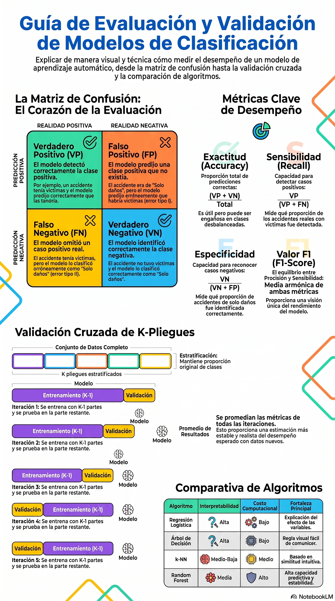

# Evaluación, validación y comparación de modelos

::: {.callout-note title="Conexión con el volumen teórico"}
La formulación matemática de matrices de confusión, métricas, validación y selección de modelos se desarrolla con mayor profundidad en los capítulos 6 y 7 de *Fundamentos Matemáticos del Aprendizaje Automático* [@rodriguez2026fundamentos].
:::

## Objetivos del capítulo

Al finalizar este capítulo, el lector será capaz de:

- explicar por qué la exactitud no siempre es suficiente;
- construir e interpretar una matriz de confusión;
- calcular exactitud, sensibilidad, especificidad, precisión, F1 y exactitud balanceada;
- distinguir entrenamiento, validación cruzada y prueba final;
- seleccionar un umbral sin utilizar el conjunto de prueba;
- interpretar ROC/AUC como medidas de discriminación;
- distinguir discriminación de calibración;
- comparar modelos sobre la misma muestra, partición y métricas;
- seleccionar un modelo considerando desempeño, estabilidad, interpretación y costo de errores.

## Evaluar es estimar generalización

Entrenar un modelo es solo una parte del aprendizaje automático. La pregunta central es:

> **¿Qué tan bien funcionará con observaciones que no participaron en su construcción?**

Un modelo puede ajustarse muy bien al entrenamiento y fallar con datos nuevos. Por eso la evaluación debe proteger la independencia de la prueba y utilizar métricas coherentes con el objetivo del problema [@kohavi1995crossvalidation; @james2021islr].

::: {.callout-important title="Principio de separación"}
Todo paso que aprende de los datos —imputación, escalamiento, selección de variables, elección de hiperparámetros o ajuste de umbrales— debe realizarse usando entrenamiento y, cuando corresponda, validación. La prueba final no participa en esas decisiones.
:::

## Cargar y preparar ATUS

```{r cargar-evaluacion-atus}
library(readr)
library(dplyr)
library(tidyr)
library(ggplot2)
source("util_graficas.R")

ruta_atus_ml <- "datos/atus_ml_preparado.csv"

if (!file.exists(ruta_atus_ml)) {
  stop("No se encontró datos/atus_ml_preparado.csv. Ejecute primero el capítulo 2.")
}

atus_ml <- read_csv(ruta_atus_ml, show_col_types = FALSE)

set.seed(2026)
atus_eval <- atus_ml |>
  mutate(
    accidente_con_victimas = factor(
      accidente_con_victimas,
      levels = c("Solo daños", "Con víctimas")
    ),
    MES = factor(MES),
    ID_HORA_NUM = suppressWarnings(as.numeric(ID_HORA)),
    ID_HORA_NUM = ifelse(
      ID_HORA_NUM >= 0 & ID_HORA_NUM <= 23,
      ID_HORA_NUM,
      NA_real_
    ),
    DIASEMANA = factor(DIASEMANA),
    TIPACCID = factor(TIPACCID),
    CAUSAACCI = factor(CAUSAACCI)
  ) |>
  drop_na(
    accidente_con_victimas,
    MES,
    ID_HORA_NUM,
    DIASEMANA,
    TIPACCID,
    CAUSAACCI
  ) |>
  slice_sample(n = min(15000, n()))

prop.table(table(atus_eval$accidente_con_victimas))
```

::: {.callout-tip title="Desbalance"}
Cuando una clase es mucho más frecuente, una exactitud alta puede obtenerse incluso con un modelo que casi siempre predice la clase mayoritaria. Por eso utilizaremos varias métricas y una referencia sencilla.
:::

## Matriz de confusión

Para la clase positiva **Con víctimas**:

| Clase real | Predicción positiva | Predicción negativa |
|---|---:|---:|
| Positiva | VP | FN |
| Negativa | FP | VN |

Las métricas principales son

$$
\text{Exactitud}=\frac{VP+VN}{VP+FN+FP+VN},
$$

$$
\text{Sensibilidad}=\frac{VP}{VP+FN},
\qquad
\text{Especificidad}=\frac{VN}{VN+FP},
$$

$$
\text{Precisión}=\frac{VP}{VP+FP},
$$

$$
F_1=2\frac{\text{Precisión}\cdot\text{Sensibilidad}}
{\text{Precisión}+\text{Sensibilidad}},
$$

y

$$
\text{Exactitud balanceada}=
\frac{\text{Sensibilidad}+\text{Especificidad}}{2}.
$$

## Funciones de evaluación

```{r funciones-evaluacion}
calcular_metricas <- function(real, predicho, positiva, negativa) {
  real <- factor(real, levels = c(negativa, positiva))
  predicho <- factor(predicho, levels = c(negativa, positiva))
  m <- table(Real = real, Predicho = predicho)

  VP <- m[positiva, positiva]
  FN <- m[positiva, negativa]
  FP <- m[negativa, positiva]
  VN <- m[negativa, negativa]

  div <- function(a, b) if (b == 0) NA_real_ else as.numeric(a / b)

  sensibilidad <- div(VP, VP + FN)
  especificidad <- div(VN, VN + FP)
  precision <- div(VP, VP + FP)
  f1 <- if (
    is.na(precision) || is.na(sensibilidad) ||
    precision + sensibilidad == 0
  ) {
    NA_real_
  } else {
    2 * precision * sensibilidad / (precision + sensibilidad)
  }

  list(
    matriz = m,
    metricas = data.frame(
      exactitud = div(VP + VN, sum(m)),
      sensibilidad = sensibilidad,
      especificidad = especificidad,
      precision = precision,
      f1 = f1,
      exactitud_balanceada = mean(c(sensibilidad, especificidad), na.rm = TRUE)
    )
  )
}

auc_por_rangos <- function(y_binaria, probabilidad) {
  n1 <- sum(y_binaria == 1)
  n0 <- sum(y_binaria == 0)
  if (n1 == 0 || n0 == 0) return(NA_real_)

  rangos <- rank(probabilidad, ties.method = "average")
  (sum(rangos[y_binaria == 1]) - n1 * (n1 + 1) / 2) / (n1 * n0)
}
```

## División estratificada entrenamiento-prueba

El 80 % se utiliza para desarrollo del modelo y el 20 % queda reservado hasta el final.

```{r division-evaluacion-atus}
set.seed(2026)

idx_train <- unlist(
  lapply(
    split(seq_len(nrow(atus_eval)), atus_eval$accidente_con_victimas),
    function(ids) sample(ids, floor(0.80 * length(ids)))
  )
)

idx_train <- sort(idx_train)
entrenamiento <- atus_eval[idx_train, ]
prueba <- atus_eval[-idx_train, ]

rbind(
  entrenamiento = prop.table(table(entrenamiento$accidente_con_victimas)),
  prueba = prop.table(table(prueba$accidente_con_victimas))
)
```

## Modelo de referencia: clase mayoritaria

```{r referencia-evaluacion}
clase_mayoritaria <- names(
  which.max(table(entrenamiento$accidente_con_victimas))
)

pred_ref <- factor(
  rep(clase_mayoritaria, nrow(prueba)),
  levels = levels(entrenamiento$accidente_con_victimas)
)

resultado_ref <- calcular_metricas(
  prueba$accidente_con_victimas,
  pred_ref,
  positiva = "Con víctimas",
  negativa = "Solo daños"
)

resultado_ref$matriz
resultado_ref$metricas
```

::: {.callout-warning title="La referencia es obligatoria"}
Un modelo complejo debe superar o justificar claramente su uso frente a una regla simple. Si una clase domina, la exactitud de la regla mayoritaria puede ser sorprendentemente alta aunque su sensibilidad para la clase minoritaria sea nula.
:::

# Selección de umbral sin tocar la prueba

## Crear pliegues estratificados dentro del entrenamiento

```{r crear-pliegues-evaluacion}
crear_pliegues <- function(respuesta, k = 5, semilla = 2026) {
  set.seed(semilla)
  respuesta <- factor(respuesta)
  pliegues <- integer(length(respuesta))

  for (clase in levels(respuesta)) {
    ids <- which(respuesta == clase)
    etiquetas <- rep(seq_len(k), length.out = length(ids))
    pliegues[ids] <- sample(etiquetas)
  }

  pliegues
}

pliegue <- crear_pliegues(
  entrenamiento$accidente_con_victimas,
  k = 5,
  semilla = 2026
)

table(pliegue, entrenamiento$accidente_con_victimas)
```

## Obtener probabilidades fuera de pliegue

Cada observación de entrenamiento recibe una probabilidad producida por un modelo que **no fue entrenado con esa observación**.

```{r probabilidades-oof-logistica}
prob_oof <- rep(NA_real_, nrow(entrenamiento))

for (k in 1:5) {
  datos_train_cv <- entrenamiento[pliegue != k, ]
  datos_val_cv <- entrenamiento[pliegue == k, ]

  modelo_cv <- glm(
    accidente_con_victimas ~
      MES + ID_HORA_NUM + DIASEMANA + TIPACCID + CAUSAACCI,
    data = datos_train_cv,
    family = binomial
  )

  prob_oof[pliegue == k] <- predict(
    modelo_cv,
    newdata = datos_val_cv,
    type = "response"
  )
}

summary(prob_oof)
```

Como **Con víctimas** es el segundo nivel del factor, `glm()` modela su probabilidad.

## Elegir el umbral con exactitud balanceada

```{r seleccionar-umbral-oof}
umbrales <- seq(0.10, 0.90, by = 0.05)

metricas_umbral <- do.call(
  rbind,
  lapply(umbrales, function(umbral) {
    pred <- factor(
      ifelse(prob_oof >= umbral, "Con víctimas", "Solo daños"),
      levels = c("Solo daños", "Con víctimas")
    )

    m <- calcular_metricas(
      entrenamiento$accidente_con_victimas,
      pred,
      positiva = "Con víctimas",
      negativa = "Solo daños"
    )$metricas

    cbind(umbral = umbral, m)
  })
)

metricas_umbral

umbral_optimo <- metricas_umbral$umbral[
  which.max(metricas_umbral$exactitud_balanceada)
]

umbral_optimo
```

```{r grafica-umbrales-oof, fig.width=7.5, fig.height=4.8}
metricas_umbral_largas <- metricas_umbral |>
  select(umbral, sensibilidad, especificidad, exactitud_balanceada, f1) |>
  pivot_longer(
    cols = -umbral,
    names_to = "metrica",
    values_to = "valor"
  )

ggplot(
  metricas_umbral_largas,
  aes(x = umbral, y = valor, color = metrica)
) +
  geom_line(linewidth = 1.05) +
  geom_point(size = 2) +
  geom_vline(xintercept = umbral_optimo, linetype = 2) +
  labs(
    title = "Selección del umbral con predicciones fuera de pliegue",
    subtitle = "La prueba final no participa en esta decisión",
    x = "Umbral",
    y = "Métrica",
    color = "Métrica"
  ) +
  tema_libro()
```

::: {.callout-note title="El criterio depende del problema"}
Aquí se maximiza exactitud balanceada para dar igual importancia a sensibilidad y especificidad. En otro contexto podría priorizarse sensibilidad, precisión, costo esperado o una función de utilidad definida con expertos.
:::

# Discriminación: ROC y AUC

La curva ROC representa sensibilidad frente a la tasa de falsos positivos para muchos umbrales. El AUC resume la capacidad de ordenar observaciones positivas por encima de negativas [@fawcett2006roc].

```{r auc-oof-evaluacion}
y_oof <- ifelse(
  entrenamiento$accidente_con_victimas == "Con víctimas",
  1,
  0
)

auc_oof <- auc_por_rangos(y_oof, prob_oof)
auc_oof
```

```{r curva-roc-oof, fig.width=6.2, fig.height=5}
umbrales_roc <- sort(unique(c(0, prob_oof, 1)), decreasing = TRUE)

roc_oof <- do.call(
  rbind,
  lapply(umbrales_roc, function(u) {
    pred_bin <- ifelse(prob_oof >= u, 1, 0)
    VP <- sum(pred_bin == 1 & y_oof == 1)
    FN <- sum(pred_bin == 0 & y_oof == 1)
    FP <- sum(pred_bin == 1 & y_oof == 0)
    VN <- sum(pred_bin == 0 & y_oof == 0)

    data.frame(
      fpr = ifelse(FP + VN == 0, NA, FP / (FP + VN)),
      tpr = ifelse(VP + FN == 0, NA, VP / (VP + FN))
    )
  })
)

ggplot(roc_oof, aes(x = fpr, y = tpr)) +
  geom_abline(slope = 1, intercept = 0, linetype = 2) +
  geom_path(linewidth = 1.1, color = col_azul) +
  coord_equal(xlim = c(0, 1), ylim = c(0, 1)) +
  labs(
    title = paste0("ROC fuera de pliegue; AUC = ", round(auc_oof, 3)),
    x = "Tasa de falsos positivos",
    y = "Sensibilidad"
  ) +
  tema_libro()
```

::: {.callout-warning title="AUC no es calibración"}
AUC mide discriminación o capacidad de ordenamiento. Un modelo puede tener buen AUC y, sin embargo, producir probabilidades sistemáticamente demasiado altas o demasiado bajas.
:::

# Ajuste final y evaluación única en prueba

## Entrenar con todo el conjunto de desarrollo

```{r modelo-final-evaluacion}
modelo_logistico_final <- glm(
  accidente_con_victimas ~
    MES + ID_HORA_NUM + DIASEMANA + TIPACCID + CAUSAACCI,
  data = entrenamiento,
  family = binomial
)

prob_test <- predict(
  modelo_logistico_final,
  newdata = prueba,
  type = "response"
)

pred_test <- factor(
  ifelse(prob_test >= umbral_optimo, "Con víctimas", "Solo daños"),
  levels = c("Solo daños", "Con víctimas")
)

resultado_logistico <- calcular_metricas(
  prueba$accidente_con_victimas,
  pred_test,
  positiva = "Con víctimas",
  negativa = "Solo daños"
)

resultado_logistico$matriz
resultado_logistico$metricas
```

## AUC final de prueba

```{r auc-test-evaluacion}
y_test_bin <- ifelse(
  prueba$accidente_con_victimas == "Con víctimas",
  1,
  0
)

auc_test <- auc_por_rangos(y_test_bin, prob_test)
auc_test
```

## Calibración en prueba

```{r calibracion-test-evaluacion}
calibracion_test <- data.frame(
  probabilidad = prob_test,
  real = y_test_bin
) |>
  mutate(grupo = ntile(probabilidad, 10)) |>
  group_by(grupo) |>
  summarise(
    n = n(),
    probabilidad_media = mean(probabilidad),
    frecuencia_observada = mean(real),
    .groups = "drop"
  )

calibracion_test
```

```{r grafica-calibracion-test, fig.width=6.2, fig.height=5}
ggplot(
  calibracion_test,
  aes(x = probabilidad_media, y = frecuencia_observada)
) +
  geom_abline(slope = 1, intercept = 0, linetype = 2) +
  geom_point(size = 3) +
  geom_line() +
  coord_equal(xlim = c(0, 1), ylim = c(0, 1)) +
  labs(
    title = "Calibración en el conjunto de prueba",
    x = "Probabilidad media predicha",
    y = "Frecuencia observada"
  ) +
  tema_libro()
```

::: {.callout-note title="La calibración también depende del muestreo"}
Las probabilidades solo conservan una interpretación poblacional adecuada cuando el proceso de muestreo y la prevalencia lo permiten o cuando se aplican correcciones apropiadas.
:::

## Comparación con la referencia

```{r comparacion-referencia-logistica}
comparacion_atus <- bind_rows(
  cbind(modelo = "Regla mayoritaria", resultado_ref$metricas),
  cbind(modelo = "Regresión logística", resultado_logistico$metricas)
)

comparacion_atus
```

```{r grafica-comparacion-evaluacion, fig.width=7.5, fig.height=4.8}
comparacion_larga <- comparacion_atus |>
  pivot_longer(
    cols = -modelo,
    names_to = "metrica",
    values_to = "valor"
  )

ggplot(
  comparacion_larga,
  aes(x = metrica, y = valor, fill = modelo)
) +
  geom_col(position = "dodge") +
  scale_y_continuous(limits = c(0, 1)) +
  labs(
    title = "Comparación final con una referencia sencilla",
    x = "Métrica",
    y = "Valor",
    fill = "Modelo"
  ) +
  tema_libro()
```

**Fuente:** Elaboración propia con datos del INEGI, ATUS 2024 [@inegi_atus_2024].

# Benchmark didáctico común con COVID-19

Hasta este punto del libro se han estudiado regresión logística, k-NN, árbol de decisión y Random Forest. Los compararemos usando **la misma muestra, las mismas variables y la misma partición**. SVM, Naive Bayes y redes neuronales se incorporarán a la comparación integral después de desarrollar sus capítulos.

::: {.callout-important title="Benchmark educativo, no evaluación clínica"}
Para facilitar la comparación se construye una muestra balanceada entre clases. Las métricas describen este banco de pruebas y no la prevalencia de defunción ni el riesgo de la población.
:::

## Seleccionar el periodo y construir una muestra balanceada

```{r covid-benchmark-preparar}
conteo_covid <- read_csv(
  "datos/covid19/procesados/conteo_casos_confirmados_2020_2025.csv",
  show_col_types = FALSE
)

anio_covid <- conteo_covid |>
  filter(ESTADO == "PROCESADO", !is.na(CASOS_CONFIRMADOS)) |>
  slice_max(CASOS_CONFIRMADOS, n = 1, with_ties = FALSE) |>
  pull(ANIO)

ruta_covid <- file.path(
  "datos/covid19/procesados",
  paste0("covid19_mexico_", anio_covid, "_ml_preparado.csv.gz")
)

covid_comp_base <- read_csv(ruta_covid, show_col_types = FALSE) |>
  select(
    MURIO, EDAD, NEUMONIA, DIABETES, HIPERTENSION,
    OBESIDAD, RENAL_CRONICA, NUM_COMORBILIDADES
  ) |>
  drop_na() |>
  mutate(
    MURIO = factor(
      MURIO,
      levels = c(0, 1),
      labels = c("Sin defunción", "Defunción")
    )
  )

set.seed(2026)
n_por_clase <- min(2000, min(table(covid_comp_base$MURIO)))

covid_comp <- covid_comp_base |>
  group_by(MURIO) |>
  slice_sample(n = n_por_clase) |>
  ungroup()
```

## Partición común 80/20

```{r covid-benchmark-particion}
set.seed(2026)

idx_covid_train <- unlist(
  lapply(
    split(seq_len(nrow(covid_comp)), covid_comp$MURIO),
    function(ids) sample(ids, floor(0.80 * length(ids)))
  )
)

train_comp <- covid_comp[sort(idx_covid_train), ]
test_comp <- covid_comp[-sort(idx_covid_train), ]

prop.table(table(train_comp$MURIO))
prop.table(table(test_comp$MURIO))
```

## Métrica común

```{r covid-benchmark-metrica}
metricas_covid <- function(real, predicho) {
  calcular_metricas(
    real,
    predicho,
    positiva = "Defunción",
    negativa = "Sin defunción"
  )$metricas
}
```

## 1. Regresión logística

```{r covid-benchmark-logistica}
modelo_log_comp <- glm(
  MURIO ~ EDAD + NEUMONIA + DIABETES + HIPERTENSION +
    OBESIDAD + RENAL_CRONICA + NUM_COMORBILIDADES,
  data = train_comp,
  family = binomial
)

prob_log_comp <- predict(modelo_log_comp, test_comp, type = "response")
pred_log_comp <- factor(
  ifelse(prob_log_comp >= 0.50, "Defunción", "Sin defunción"),
  levels = levels(train_comp$MURIO)
)
```

## 2. k-NN

Para este benchmark se fija $k=11$ **antes de observar la prueba**. El objetivo es una comparación didáctica común, no una búsqueda exhaustiva de hiperparámetros.

```{r covid-benchmark-knn}
vars_comp <- c(
  "EDAD", "NEUMONIA", "DIABETES", "HIPERTENSION",
  "OBESIDAD", "RENAL_CRONICA", "NUM_COMORBILIDADES"
)

X_train <- as.matrix(train_comp[vars_comp])
X_test <- as.matrix(test_comp[vars_comp])

X_train_z <- X_train
X_test_z <- X_test

for (variable in c("EDAD", "NUM_COMORBILIDADES")) {
  media <- mean(X_train[, variable])
  desv <- sd(X_train[, variable])
  if (desv == 0) desv <- 1

  X_train_z[, variable] <- (X_train[, variable] - media) / desv
  X_test_z[, variable] <- (X_test[, variable] - media) / desv
}

pred_knn_comp <- class::knn(
  train = X_train_z,
  test = X_test_z,
  cl = train_comp$MURIO,
  k = 11
)
```

## 3. Árbol de decisión

La complejidad se selecciona por validación cruzada interna del entrenamiento.

```{r covid-benchmark-arbol}
arbol_grande_comp <- rpart::rpart(
  MURIO ~ EDAD + NEUMONIA + DIABETES + HIPERTENSION +
    OBESIDAD + RENAL_CRONICA + NUM_COMORBILIDADES,
  data = train_comp,
  method = "class",
  control = rpart::rpart.control(
    cp = 0.0005,
    minsplit = 60,
    minbucket = 20,
    maxdepth = 8,
    xval = 5
  )
)

cp_comp <- arbol_grande_comp$cptable[
  which.min(arbol_grande_comp$cptable[, "xerror"]),
  "CP"
]

modelo_arbol_comp <- rpart::prune(arbol_grande_comp, cp = cp_comp)
pred_arbol_comp <- predict(modelo_arbol_comp, test_comp, type = "class")
```

## 4. Random Forest

Se fija `mtry = 3` antes de la evaluación final para mantener el benchmark ligero y reproducible.

```{r covid-benchmark-rf}
set.seed(2026)

modelo_rf_comp <- ranger::ranger(
  MURIO ~ EDAD + NEUMONIA + DIABETES + HIPERTENSION +
    OBESIDAD + RENAL_CRONICA + NUM_COMORBILIDADES,
  data = train_comp,
  num.trees = 250,
  mtry = 3,
  min.node.size = 20,
  probability = FALSE,
  seed = 2026
)

pred_rf_comp <- predict(modelo_rf_comp, test_comp)$predictions
```

## Tabla comparativa

```{r covid-benchmark-tabla}
comparacion_covid <- bind_rows(
  cbind(modelo = "Regresión logística", metricas_covid(test_comp$MURIO, pred_log_comp)),
  cbind(modelo = "k-NN (k=11)", metricas_covid(test_comp$MURIO, pred_knn_comp)),
  cbind(modelo = "Árbol de decisión", metricas_covid(test_comp$MURIO, pred_arbol_comp)),
  cbind(modelo = "Random Forest", metricas_covid(test_comp$MURIO, pred_rf_comp))
)

comparacion_covid |>
  mutate(across(where(is.numeric), ~ round(.x, 3)))
```

```{r covid-benchmark-grafica, fig.width=8, fig.height=5}
comparacion_covid_larga <- comparacion_covid |>
  pivot_longer(
    cols = -modelo,
    names_to = "metrica",
    values_to = "valor"
  )

ggplot(
  comparacion_covid_larga,
  aes(x = modelo, y = valor, fill = metrica)
) +
  geom_col(position = "dodge") +
  coord_flip() +
  scale_y_continuous(limits = c(0, 1)) +
  labs(
    title = "Benchmark común con COVID-19",
    subtitle = "Misma muestra balanceada y misma partición de prueba",
    x = NULL,
    y = "Valor de la métrica",
    fill = "Métrica"
  ) +
  tema_libro()
```

::: {.callout-important title="No existe un ganador universal"}
La mejor alternativa depende del costo de los errores, estabilidad, capacidad de explicación, costo computacional y necesidad de probabilidades calibradas. Una diferencia pequeña en exactitud no justifica automáticamente un modelo mucho más complejo.
:::

# Laboratorio interactivo: matriz de confusión

::: {.content-visible when-format="html"}
Modifique VP, VN, FP y FN para observar cómo cambian las métricas.

```{shinylive-r}
#| standalone: true
#| viewerHeight: 720
#| components: [viewer]

library(shiny)

ui <- fluidPage(
  titlePanel("Calculadora de métricas de clasificación"),
  sidebarLayout(
    sidebarPanel(
      numericInput("vp", "Verdaderos positivos", 40, min = 0),
      numericInput("vn", "Verdaderos negativos", 45, min = 0),
      numericInput("fp", "Falsos positivos", 5, min = 0),
      numericInput("fn", "Falsos negativos", 10, min = 0)
    ),
    mainPanel(
      tableOutput("matriz"),
      tableOutput("metricas"),
      plotOutput("grafica", height = "320px")
    )
  )
)

server <- function(input, output, session) {
  calc <- reactive({
    vp <- input$vp; vn <- input$vn; fp <- input$fp; fn <- input$fn
    total <- vp + vn + fp + fn
    exactitud <- ifelse(total == 0, NA, (vp + vn) / total)
    sensibilidad <- ifelse(vp + fn == 0, NA, vp / (vp + fn))
    especificidad <- ifelse(vn + fp == 0, NA, vn / (vn + fp))
    precision <- ifelse(vp + fp == 0, NA, vp / (vp + fp))
    f1 <- ifelse(
      is.na(precision) || is.na(sensibilidad) || precision + sensibilidad == 0,
      NA,
      2 * precision * sensibilidad / (precision + sensibilidad)
    )
    balanceada <- mean(c(sensibilidad, especificidad), na.rm = TRUE)

    list(
      matriz = matrix(
        c(vn, fp, fn, vp),
        nrow = 2,
        byrow = TRUE,
        dimnames = list(
          "Real" = c("Clase 0", "Clase 1"),
          "Predicho" = c("Clase 0", "Clase 1")
        )
      ),
      metricas = c(
        Exactitud = exactitud,
        Sensibilidad = sensibilidad,
        Especificidad = especificidad,
        Precision = precision,
        F1 = f1,
        Exactitud_balanceada = balanceada
      )
    )
  })

  output$matriz <- renderTable({
    as.data.frame.matrix(calc()$matriz)
  }, rownames = TRUE)

  output$metricas <- renderTable({
    data.frame(
      Métrica = names(calc()$metricas),
      Valor = round(as.numeric(calc()$metricas), 4)
    )
  })

  output$grafica <- renderPlot({
    m <- calc()$metricas
    barplot(
      m,
      ylim = c(0, 1),
      ylab = "Valor",
      main = "Métricas del modelo"
    )
    abline(h = seq(0, 1, by = 0.2), lty = 3)
  })
}

shinyApp(ui, server)
```
:::

::: {.content-visible when-format="pdf"}
### Laboratorio disponible en la versión web
La calculadora permite editar la matriz de confusión y obtener automáticamente las métricas principales.
:::

## Materiales complementarios del capítulo

| Recurso | Utilidad | Abrir o reproducir | Descargar |
|---|---|---|---|
| Video explicativo | Explicación audiovisual de evaluación, validación y comparación. | [Ver en YouTube](https://www.youtube.com/watch?v=ShiKrfhIfpY){target="_blank"} | — |
| Presentación en PDF | Diapositivas para lectura, estudio o exposición. | [Ver PDF](recursos/capitulo-09/capitulo-09-evaluacion-modelos-presentacion.pdf){target="_blank"} | [Descargar PDF](recursos/capitulo-09/capitulo-09-evaluacion-modelos-presentacion.pdf){download="capitulo-09-evaluacion-modelos-presentacion.pdf"} |
| Presentación editable | Archivo PowerPoint para utilizarlo en clase o adaptarlo. | [Abrir PPTX](recursos/capitulo-09/capitulo-09-evaluacion-modelos-presentacion.pptx) | [Descargar PPTX](recursos/capitulo-09/capitulo-09-evaluacion-modelos-presentacion.pptx){download="capitulo-09-evaluacion-modelos-presentacion.pptx"} |
| Infografía | Resumen visual de las ideas fundamentales. | [Ver infografía](recursos/capitulo-09/capitulo-09-evaluacion-modelos-infografia.png){target="_blank"} | [Descargar PNG](recursos/capitulo-09/capitulo-09-evaluacion-modelos-infografia.png){download="capitulo-09-evaluacion-modelos-infografia.png"} |
| Cuaderno Google Colab | Cuaderno autónomo para ejecutar los ejemplos del capítulo. | [Abrir en Google Colab](https://colab.research.google.com/github/gilbertorodriguez59/libro-machine-learning-r/blob/main/colab/09-evaluacion-modelos.ipynb){target="_blank"} | — |

::: {.content-visible when-format="html"}
### Video explicativo

<div class="video-responsive">
  <iframe
    src="https://www.youtube.com/embed/ShiKrfhIfpY"
    title="Capítulo 9. Evaluación y comparación de modelos"
    frameborder="0"
    allow="accelerometer; autoplay; clipboard-write; encrypted-media; gyroscope; picture-in-picture; web-share"
    referrerpolicy="strict-origin-when-cross-origin"
    allowfullscreen>
  </iframe>
</div>

### Vista previa de la infografía

[](recursos/capitulo-09/capitulo-09-evaluacion-modelos-infografia.png)
:::

::: {.content-visible when-format="pdf"}
**Video del capítulo:** <https://www.youtube.com/watch?v=ShiKrfhIfpY>

La presentación PDF, el archivo editable, la infografía y el cuaderno Colab pueden consultarse desde la versión web del libro.
:::

::: {.callout-note title="Elaboración de los materiales"}
Los materiales complementarios fueron elaborados con apoyo de **NotebookLM de Google**, a partir del contenido del capítulo, y posteriormente revisados y adaptados por el autor.
:::

## Actividades para el lector

1. Cambie el criterio de selección del umbral: maximice sensibilidad con especificidad mínima de 0.70.
2. Compare AUC y exactitud balanceada y explique por qué no responden la misma pregunta.
3. Repita el benchmark COVID conservando el desbalance natural y compare las conclusiones.
4. Añada SVM, Naive Bayes y redes neuronales después de estudiar sus capítulos.
5. Escriba una recomendación técnica de no más de 200 palabras justificando una elección de modelo.

## Conclusión

Una evaluación profesional separa claramente **desarrollo** de **prueba final**. Los hiperparámetros y umbrales se eligen sin mirar la prueba; AUC evalúa discriminación, la calibración evalúa probabilidades y las métricas dependientes del umbral cuantifican tipos concretos de error. La comparación justa exige la misma muestra, la misma partición y criterios comunes. El mejor modelo no es universal: depende del objetivo y de las consecuencias de equivocarse.

## Referencias fundamentales

La validación cruzada fue examinada comparativamente por @kohavi1995crossvalidation. Para ROC y AUC, una referencia ampliamente utilizada es @fawcett2006roc. Una visión integrada de partición, remuestreo y comparación de modelos aparece en @james2021islr.
