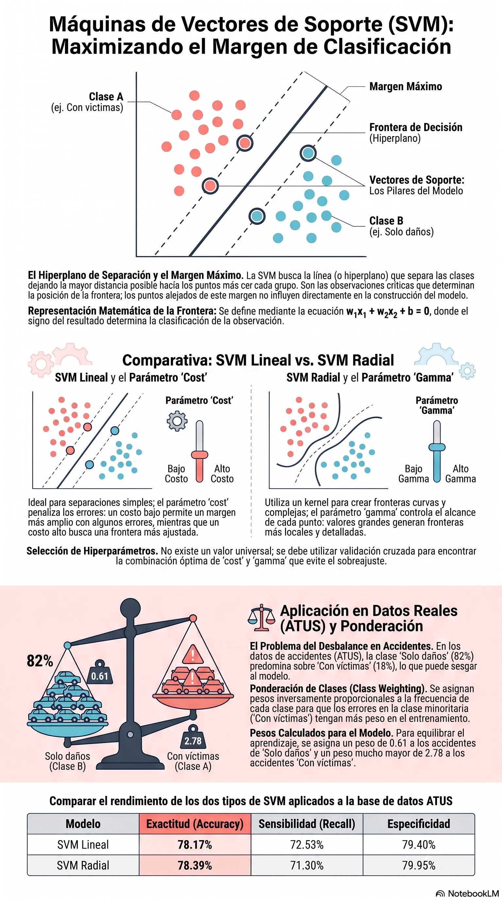

# Máquinas de Vectores de Soporte (SVM)

::: {.callout-note title="Conexión con el volumen teórico"}
La formulación matemática de **margen, optimización convexa, condiciones KKT y kernels** se desarrolla con mayor profundidad en los capítulos 4 y 15 de *Fundamentos Matemáticos del Aprendizaje Automático* [@rodriguez2026fundamentos].
:::

## Objetivos del capítulo

Al finalizar este capítulo, el lector será capaz de:

- explicar la idea del hiperplano de separación y del margen máximo;
- identificar los vectores de soporte;
- distinguir margen duro y margen suave;
- comparar una SVM lineal y una SVM con kernel radial;
- interpretar el papel de `cost`, `gamma`, el escalamiento y los pesos de clase;
- seleccionar kernel e hiperparámetros usando validación, sin utilizar la prueba final;
- evaluar una SVM con exactitud, sensibilidad, especificidad, precisión, F1 y exactitud balanceada;
- aplicar el método a ATUS y a una ruta educativa de COVID-19.

## Intuición geométrica

Para dos predictores, una frontera lineal puede escribirse como

$$
w_1x_1+w_2x_2+b=0.
$$

En el caso idealmente separable se busca una frontera que satisfaga

$$
y_i(\mathbf{w}^{T}\mathbf{x}_i+b)\geq 1,
$$

con $y_i\in\{-1,1\}$. El ancho del margen es proporcional a

$$
\frac{2}{\lVert\mathbf{w}\rVert}.
$$

Las observaciones que quedan sobre o dentro de los márgenes son las que determinan directamente la solución y reciben el nombre de **vectores de soporte** [@cortes1995support; @burges1998tutorial].

::: {.callout-tip title="Idea esencial"}
La SVM no busca únicamente acertar en entrenamiento. Busca una frontera que equilibre separación y errores, con la intención de generalizar a observaciones nuevas.
:::

## Margen suave y parámetro `cost`

En datos reales casi nunca existe separación perfecta. La SVM de margen suave permite violaciones mediante variables de holgura $\xi_i$ y resuelve, de forma esquemática,

$$
\min_{\mathbf{w},b,\xi}
\frac{1}{2}\lVert\mathbf{w}\rVert^2+C\sum_i\xi_i.
$$

El parámetro `cost` corresponde a $C$:

- valores pequeños toleran más violaciones y favorecen un margen amplio;
- valores grandes penalizan más los errores y pueden producir una frontera más ajustada al entrenamiento.

No existe un `cost` universalmente mejor: debe seleccionarse con validación.

## Kernels

Cuando una frontera lineal es insuficiente, una SVM puede utilizar una función kernel. El kernel radial se escribe como

$$
K(\mathbf{x}_i,\mathbf{x}_j)=
\exp\left(-\gamma\lVert\mathbf{x}_i-\mathbf{x}_j\rVert^2\right).
$$

El parámetro $\gamma$ controla el alcance de la influencia de cada observación:

- valores pequeños producen fronteras más suaves;
- valores grandes permiten fronteras más locales y complejas.

::: {.callout-warning title="Complejidad y sobreajuste"}
Una combinación grande de `cost` y `gamma` puede ajustar muy bien el entrenamiento y generalizar peor. Ambos hiperparámetros deben seleccionarse sin mirar la prueba final.
:::

## Ejemplo geométrico con datos simulados

```{r svm-datos-simulados}
set.seed(123)

n <- 120

datos_svm <- data.frame(
  x1 = c(
    rnorm(n / 2, mean = -1.5, sd = 0.8),
    rnorm(n / 2, mean =  1.5, sd = 0.8)
  ),
  x2 = c(
    rnorm(n / 2, mean = -1.0, sd = 0.9),
    rnorm(n / 2, mean =  1.0, sd = 0.9)
  ),
  clase = factor(rep(c("Clase A", "Clase B"), each = n / 2))
)
```

```{r svm-grafica-datos, fig.width=7, fig.height=5}
library(ggplot2)
source("util_graficas.R")

ggplot(datos_svm, aes(x = x1, y = x2, color = clase)) +
  geom_point(size = 2.5, alpha = 0.8) +
  labs(
    title = "Datos simulados para clasificación SVM",
    x = "x1",
    y = "x2",
    color = "Clase"
  ) +
  tema_libro()
```

## Ajustar una SVM lineal e identificar soportes

```{r svm-lineal-simulada}
library(e1071)

modelo_svm_lineal <- svm(
  clase ~ x1 + x2,
  data = datos_svm,
  kernel = "linear",
  cost = 1,
  scale = TRUE
)

indices_soporte <- modelo_svm_lineal$index
vectores_soporte <- datos_svm[indices_soporte, ]

modelo_svm_lineal$tot.nSV
```

```{r svm-frontera-lineal, fig.width=7, fig.height=5}
rejilla <- expand.grid(
  x1 = seq(min(datos_svm$x1) - 0.5,
           max(datos_svm$x1) + 0.5,
           length.out = 180),
  x2 = seq(min(datos_svm$x2) - 0.5,
           max(datos_svm$x2) + 0.5,
           length.out = 180)
)

rejilla$prediccion <- predict(modelo_svm_lineal, newdata = rejilla)

ggplot() +
  geom_tile(
    data = rejilla,
    aes(x = x1, y = x2, fill = prediccion),
    alpha = 0.18
  ) +
  geom_point(
    data = datos_svm,
    aes(x = x1, y = x2, color = clase),
    size = 2.2
  ) +
  geom_point(
    data = vectores_soporte,
    aes(x = x1, y = x2),
    shape = 21,
    size = 4,
    stroke = 1.1,
    fill = NA
  ) +
  labs(
    title = "Frontera de una SVM lineal",
    subtitle = "Los círculos grandes indican vectores de soporte",
    x = "x1",
    y = "x2",
    fill = "Predicción",
    color = "Clase real"
  ) +
  tema_libro()
```

## Escalamiento sin fuga de información

Las SVM son sensibles a la escala de los predictores numéricos. En `e1071::svm()`, `scale = TRUE` estima el centro y la escala **con los datos usados para ajustar el modelo** y conserva esos parámetros para aplicarlos después a nuevos datos.

::: {.callout-important title="Orden correcto"}
Primero se separan entrenamiento, validación y prueba. Después se ajusta cada SVM con `scale = TRUE`. No se estandariza el conjunto completo antes de dividirlo.
:::

## Funciones auxiliares

```{r svm-funciones-auxiliares}
library(readr)
library(dplyr)
library(tidyr)

partir_svm_estratificado <- function(
  y,
  prop_train = 0.60,
  prop_val = 0.20,
  semilla = 2026
) {
  set.seed(semilla)
  y <- factor(y)

  idx_train <- integer(0)
  idx_val <- integer(0)
  idx_test <- integer(0)

  for (clase in levels(y)) {
    ids <- sample(which(y == clase))
    n_train <- floor(prop_train * length(ids))
    n_val <- floor(prop_val * length(ids))

    ids_train <- ids[seq_len(n_train)]
    restantes <- ids[-seq_len(n_train)]
    ids_val <- restantes[seq_len(n_val)]
    ids_test <- setdiff(restantes, ids_val)

    idx_train <- c(idx_train, ids_train)
    idx_val <- c(idx_val, ids_val)
    idx_test <- c(idx_test, ids_test)
  }

  list(
    train = sort(idx_train),
    validation = sort(idx_val),
    test = sort(idx_test)
  )
}

metricas_svm <- function(real, predicho, positiva, negativa) {
  real <- factor(real, levels = c(negativa, positiva))
  predicho <- factor(predicho, levels = c(negativa, positiva))
  m <- table(Real = real, Predicho = predicho)

  VP <- m[positiva, positiva]
  FN <- m[positiva, negativa]
  FP <- m[negativa, positiva]
  VN <- m[negativa, negativa]

  div <- function(a, b) if (b == 0) NA_real_ else as.numeric(a / b)

  sensibilidad <- div(VP, VP + FN)
  especificidad <- div(VN, VN + FP)
  precision <- div(VP, VP + FP)
  f1 <- if (
    is.na(precision) || is.na(sensibilidad) ||
    precision + sensibilidad == 0
  ) {
    NA_real_
  } else {
    2 * precision * sensibilidad / (precision + sensibilidad)
  }

  list(
    matriz = m,
    metricas = data.frame(
      exactitud = div(VP + VN, sum(m)),
      sensibilidad = sensibilidad,
      especificidad = especificidad,
      precision = precision,
      f1 = f1,
      exactitud_balanceada = mean(c(sensibilidad, especificidad), na.rm = TRUE)
    )
  )
}
```

# Caso aplicado A: ATUS

## Cargar y preparar una muestra

```{r svm-preparar-atus}
ruta_atus_ml <- "datos/atus_ml_preparado.csv"

if (!file.exists(ruta_atus_ml)) {
  stop("No se encontró datos/atus_ml_preparado.csv. Ejecute primero el capítulo 2.")
}

atus_ml <- read_csv(ruta_atus_ml, show_col_types = FALSE)

set.seed(2026)
atus_svm <- atus_ml |>
  mutate(
    accidente_con_victimas = factor(
      accidente_con_victimas,
      levels = c("Solo daños", "Con víctimas")
    ),
    MES = factor(MES),
    ID_HORA_NUM = suppressWarnings(as.numeric(ID_HORA)),
    ID_HORA_NUM = ifelse(
      ID_HORA_NUM >= 0 & ID_HORA_NUM <= 23,
      ID_HORA_NUM,
      NA_real_
    ),
    DIASEMANA = factor(DIASEMANA),
    TIPACCID = factor(TIPACCID),
    CAUSAACCI = factor(CAUSAACCI)
  ) |>
  drop_na(
    accidente_con_victimas,
    MES,
    ID_HORA_NUM,
    DIASEMANA,
    TIPACCID,
    CAUSAACCI
  ) |>
  slice_sample(n = min(6000, n()))

prop.table(table(atus_svm$accidente_con_victimas))
```

## Entrenamiento, validación y prueba

```{r svm-division-atus}
partes_atus <- partir_svm_estratificado(
  atus_svm$accidente_con_victimas,
  prop_train = 0.60,
  prop_val = 0.20,
  semilla = 2026
)

train_svm <- atus_svm[partes_atus$train, ]
val_svm <- atus_svm[partes_atus$validation, ]
test_svm <- atus_svm[partes_atus$test, ]

rbind(
  entrenamiento = prop.table(table(train_svm$accidente_con_victimas)),
  validacion = prop.table(table(val_svm$accidente_con_victimas)),
  prueba = prop.table(table(test_svm$accidente_con_victimas))
)
```

## Pesos de clase

Cuando existe desbalance, `class.weights = "inverse"` asigna pesos inversos a la frecuencia de las clases en el conjunto con el que se ajusta cada modelo.

::: {.callout-note title="Qué hacen y qué no hacen los pesos"}
Los pesos modifican el costo de los errores durante el entrenamiento. No sustituyen una evaluación con sensibilidad, especificidad y exactitud balanceada.
:::

## Selección conjunta de kernel, `cost` y `gamma`

La prueba final no participa en esta búsqueda. Se comparan siete configuraciones sobre **validación**.

```{r svm-grid-atus}
rejilla_svm <- bind_rows(
  data.frame(
    kernel = "linear",
    cost = c(0.25, 1, 4),
    gamma = NA_real_
  ),
  expand.grid(
    kernel = "radial",
    cost = c(0.5, 2),
    gamma = c(0.01, 0.05),
    stringsAsFactors = FALSE
  )
)

formula_svm <- accidente_con_victimas ~
  MES + ID_HORA_NUM + DIASEMANA + TIPACCID + CAUSAACCI
```

```{r svm-validar-grid-atus}
resultados_svm_val <- do.call(
  rbind,
  lapply(seq_len(nrow(rejilla_svm)), function(i) {
    cfg <- rejilla_svm[i, ]

    set.seed(2026 + i)

    modelo <- if (cfg$kernel == "linear") {
      svm(
        formula_svm,
        data = train_svm,
        kernel = "linear",
        cost = cfg$cost,
        class.weights = "inverse",
        scale = TRUE
      )
    } else {
      svm(
        formula_svm,
        data = train_svm,
        kernel = "radial",
        cost = cfg$cost,
        gamma = cfg$gamma,
        class.weights = "inverse",
        scale = TRUE
      )
    }

    pred <- predict(modelo, newdata = val_svm)

    m <- metricas_svm(
      val_svm$accidente_con_victimas,
      pred,
      positiva = "Con víctimas",
      negativa = "Solo daños"
    )$metricas

    cbind(
      cfg,
      vectores_soporte = modelo$tot.nSV,
      m
    )
  })
)

resultados_svm_val
```

## Elegir la configuración

```{r svm-seleccion-mejor-atus}
mejor_fila <- which.max(resultados_svm_val$exactitud_balanceada)
mejor_config <- resultados_svm_val[mejor_fila, ]

mejor_config
```

```{r svm-grafica-validacion-atus, fig.width=7.5, fig.height=5}
resultados_svm_val <- resultados_svm_val |>
  mutate(
    configuracion = ifelse(
      kernel == "linear",
      paste0("lineal C=", cost),
      paste0("radial C=", cost, ", γ=", gamma)
    )
  )

resultados_svm_largos <- resultados_svm_val |>
  select(
    configuracion,
    sensibilidad,
    especificidad,
    exactitud_balanceada
  ) |>
  pivot_longer(
    cols = -configuracion,
    names_to = "metrica",
    values_to = "valor"
  )

ggplot(
  resultados_svm_largos,
  aes(x = configuracion, y = valor, fill = metrica)
) +
  geom_col(position = "dodge") +
  coord_flip() +
  scale_y_continuous(limits = c(0, 1)) +
  labs(
    title = "Selección de SVM en validación",
    subtitle = "La prueba permanece intacta",
    x = NULL,
    y = "Métrica",
    fill = "Métrica"
  ) +
  tema_libro()
```

## Reentrenar con entrenamiento + validación

```{r svm-reentrenar-final-atus}
ref_svm <- bind_rows(train_svm, val_svm)

if (mejor_config$kernel == "linear") {
  modelo_svm_final <- svm(
    formula_svm,
    data = ref_svm,
    kernel = "linear",
    cost = mejor_config$cost,
    class.weights = "inverse",
    scale = TRUE
  )
} else {
  modelo_svm_final <- svm(
    formula_svm,
    data = ref_svm,
    kernel = "radial",
    cost = mejor_config$cost,
    gamma = mejor_config$gamma,
    class.weights = "inverse",
    scale = TRUE
  )
}

modelo_svm_final$tot.nSV
```

## Evaluación final, una sola vez

```{r svm-evaluacion-final-atus}
pred_svm_test <- predict(
  modelo_svm_final,
  newdata = test_svm
)

resultado_svm_test <- metricas_svm(
  test_svm$accidente_con_victimas,
  pred_svm_test,
  positiva = "Con víctimas",
  negativa = "Solo daños"
)

resultado_svm_test$matriz
resultado_svm_test$metricas
```

::: {.callout-important title="Interpretación correcta"}
La configuración se eligió por validación y la prueba se usó una sola vez. Si después de observar la prueba se cambia `cost`, `gamma`, kernel, pesos o predictores, esa prueba deja de ser una estimación independiente del desempeño final.
:::

## Vectores de soporte y complejidad

El número de vectores de soporte ofrece una descripción útil de cuánto del conjunto de referencia participa directamente en la frontera. No es, por sí solo, una métrica de calidad: dos modelos pueden tener distinto número de soportes y desempeños similares.

# Laboratorio interactivo: margen e hiperplano

::: {.content-visible when-format="html"}
Explore una frontera lineal de la forma $w_1x_1+w_2x_2+b=0$, sus márgenes y la clasificación de un punto nuevo.

```{shinylive-r}
#| standalone: true
#| viewerHeight: 720
#| components: [viewer]

library(shiny)

ui <- fluidPage(
  titlePanel("Explorador interactivo de una SVM lineal"),
  sidebarLayout(
    sidebarPanel(
      sliderInput("w1", "Peso w1", -3, 3, 1, step = 0.1),
      sliderInput("w2", "Peso w2", -3, 3, -1, step = 0.1),
      sliderInput("b", "Sesgo b", -3, 3, 0, step = 0.1),
      sliderInput("x1", "Punto nuevo: x1", -4, 4, 1, step = 0.1),
      sliderInput("x2", "Punto nuevo: x2", -4, 4, 1, step = 0.1)
    ),
    mainPanel(
      plotOutput("plano", height = "440px"),
      verbatimTextOutput("resultado"),
      textOutput("interpretacion")
    )
  )
)

server <- function(input, output, session) {
  valor <- reactive({
    input$w1 * input$x1 + input$w2 * input$x2 + input$b
  })

  output$plano <- renderPlot({
    plot(
      NA,
      xlim = c(-4, 4),
      ylim = c(-4, 4),
      xlab = "x1",
      ylab = "x2",
      main = "Hiperplano y márgenes"
    )
    grid()

    if (abs(input$w2) > 1e-8) {
      abline(a = -input$b / input$w2,
             b = -input$w1 / input$w2,
             lwd = 3)
      abline(a = -(input$b - 1) / input$w2,
             b = -input$w1 / input$w2,
             lty = 2)
      abline(a = -(input$b + 1) / input$w2,
             b = -input$w1 / input$w2,
             lty = 2)
    } else if (abs(input$w1) > 1e-8) {
      abline(v = -input$b / input$w1, lwd = 3)
      abline(v = -(input$b - 1) / input$w1, lty = 2)
      abline(v = -(input$b + 1) / input$w1, lty = 2)
    }

    points(input$x1, input$x2, pch = 19, cex = 2)
  })

  output$resultado <- renderPrint({
    cat("Valor de decisión:", round(valor(), 4), "\n")
    cat("Clase predicha:", ifelse(valor() >= 0, "Clase +1", "Clase -1"))
  })

  output$interpretacion <- renderText({
    paste0(
      "El signo del valor de decisión determina la clase. ",
      "Los márgenes funcionales se muestran con líneas discontinuas."
    )
  })
}

shinyApp(ui, server)
```
:::

::: {.content-visible when-format="pdf"}
### Laboratorio disponible en la versión web
La versión web permite cambiar pesos, sesgo y un punto nuevo para observar el hiperplano, los márgenes y la clase predicha.
:::

# Caso aplicado B: SVM con COVID-19

## Seleccionar el mismo periodo reproducible

```{r covid-svm-periodo}
conteo_covid <- read_csv(
  "datos/covid19/procesados/conteo_casos_confirmados_2020_2025.csv",
  show_col_types = FALSE
)

anio_covid <- conteo_covid |>
  filter(ESTADO == "PROCESADO", !is.na(CASOS_CONFIRMADOS)) |>
  slice_max(CASOS_CONFIRMADOS, n = 1, with_ties = FALSE) |>
  pull(ANIO)

ruta_covid <- file.path(
  "datos/covid19/procesados",
  paste0("covid19_mexico_", anio_covid, "_ml_preparado.csv.gz")
)

if (!file.exists(ruta_covid)) {
  stop("No se encontró la base COVID-19 seleccionada por el procedimiento reproducible.")
}
```

## Preparar y dividir la muestra

```{r covid-svm-preparar}
covid_svm <- read_csv(ruta_covid, show_col_types = FALSE) |>
  select(
    MURIO, EDAD, NEUMONIA, DIABETES, HIPERTENSION,
    OBESIDAD, RENAL_CRONICA, NUM_COMORBILIDADES
  ) |>
  drop_na() |>
  mutate(
    MURIO = factor(
      MURIO,
      levels = c(0, 1),
      labels = c("Sin defunción", "Defunción")
    )
  )

set.seed(2026)
covid_svm <- covid_svm |>
  slice_sample(n = min(6000, n()))

partes_covid <- partir_svm_estratificado(
  covid_svm$MURIO,
  prop_train = 0.60,
  prop_val = 0.20,
  semilla = 2026
)

covid_train <- covid_svm[partes_covid$train, ]
covid_val <- covid_svm[partes_covid$validation, ]
covid_test <- covid_svm[partes_covid$test, ]
```

::: {.callout-warning title="Uso exclusivamente educativo"}
Este ejercicio ilustra el comportamiento de SVM sobre datos administrativos. No constituye una herramienta clínica, diagnóstica ni pronóstica. Si la estrategia de muestreo modifica la prevalencia, tampoco deben interpretarse sus salidas como riesgo poblacional.
:::

## Seleccionar una configuración con validación

Para reducir costo computacional, la ruta COVID compara una cuadrícula más pequeña.

```{r covid-svm-validacion}
formula_covid_svm <- MURIO ~
  EDAD + NEUMONIA + DIABETES + HIPERTENSION +
  OBESIDAD + RENAL_CRONICA + NUM_COMORBILIDADES

rejilla_covid <- data.frame(
  kernel = c("linear", "radial", "radial"),
  cost = c(1, 1, 2),
  gamma = c(NA, 1 / 7, 0.05)
)

resultados_covid_svm <- do.call(
  rbind,
  lapply(seq_len(nrow(rejilla_covid)), function(i) {
    cfg <- rejilla_covid[i, ]

    modelo <- if (cfg$kernel == "linear") {
      svm(
        formula_covid_svm,
        data = covid_train,
        kernel = "linear",
        cost = cfg$cost,
        class.weights = "inverse",
        scale = TRUE
      )
    } else {
      svm(
        formula_covid_svm,
        data = covid_train,
        kernel = "radial",
        cost = cfg$cost,
        gamma = cfg$gamma,
        class.weights = "inverse",
        scale = TRUE
      )
    }

    pred <- predict(modelo, covid_val)
    m <- metricas_svm(
      covid_val$MURIO,
      pred,
      positiva = "Defunción",
      negativa = "Sin defunción"
    )$metricas

    cbind(cfg, vectores_soporte = modelo$tot.nSV, m)
  })
)

resultados_covid_svm
```

## Evaluación final COVID-19

```{r covid-svm-final}
mejor_covid <- resultados_covid_svm[
  which.max(resultados_covid_svm$exactitud_balanceada),
]

covid_ref <- bind_rows(covid_train, covid_val)

modelo_covid_final <- if (mejor_covid$kernel == "linear") {
  svm(
    formula_covid_svm,
    data = covid_ref,
    kernel = "linear",
    cost = mejor_covid$cost,
    class.weights = "inverse",
    scale = TRUE
  )
} else {
  svm(
    formula_covid_svm,
    data = covid_ref,
    kernel = "radial",
    cost = mejor_covid$cost,
    gamma = mejor_covid$gamma,
    class.weights = "inverse",
    scale = TRUE
  )
}

pred_covid_final <- predict(modelo_covid_final, covid_test)

resultado_covid_final <- metricas_svm(
  covid_test$MURIO,
  pred_covid_final,
  positiva = "Defunción",
  negativa = "Sin defunción"
)

resultado_covid_final$matriz
resultado_covid_final$metricas
```

## Ventajas y limitaciones

### Ventajas

- modela fronteras lineales y no lineales;
- puede funcionar bien en espacios con muchas variables;
- el principio de margen ofrece una regularización geométrica clara;
- admite ponderación de clases;
- la solución depende directamente de los vectores de soporte.

### Limitaciones

- puede ser costosa en conjuntos grandes;
- requiere seleccionar kernel e hiperparámetros;
- es menos interpretable que una regresión logística o un árbol pequeño;
- es sensible a la escala de las variables numéricas;
- una búsqueda extensa de hiperparámetros puede ser computacionalmente pesada.

## Materiales complementarios del capítulo

| Recurso | Utilidad | Abrir o reproducir | Descargar |
|---|---|---|---|
| Video explicativo | Explicación audiovisual de margen, kernels y SVM. | [Ver en YouTube](https://www.youtube.com/watch?v=upiQi4xIBrQ){target="_blank"} | — |
| Presentación en PDF | Diapositivas para lectura, estudio o exposición. | [Ver PDF](recursos/capitulo-10/capitulo-10-svm-presentacion.pdf){target="_blank"} | [Descargar PDF](recursos/capitulo-10/capitulo-10-svm-presentacion.pdf){download="capitulo-10-svm-presentacion.pdf"} |
| Presentación editable | Archivo PowerPoint para utilizarlo en clase o adaptarlo. | [Abrir PPTX](recursos/capitulo-10/capitulo-10-svm-presentacion.pptx) | [Descargar PPTX](recursos/capitulo-10/capitulo-10-svm-presentacion.pptx){download="capitulo-10-svm-presentacion.pptx"} |
| Infografía | Resumen visual de margen, soporte y kernels. | [Ver infografía](recursos/capitulo-10/capitulo-10-svm-infografia.png){target="_blank"} | [Descargar PNG](recursos/capitulo-10/capitulo-10-svm-infografia.png){download="capitulo-10-svm-infografia.png"} |
| Cuaderno Google Colab | Cuaderno autónomo para ejecutar los ejemplos del capítulo. | [Abrir en Google Colab](https://colab.research.google.com/github/gilbertorodriguez59/libro-machine-learning-r/blob/main/colab/10-svm.ipynb){target="_blank"} | — |

::: {.content-visible when-format="html"}
### Video explicativo

<div class="video-responsive">
  <iframe
    src="https://www.youtube.com/embed/upiQi4xIBrQ"
    title="Capítulo 10. Máquinas de vectores de soporte, SVM"
    frameborder="0"
    allow="accelerometer; autoplay; clipboard-write; encrypted-media; gyroscope; picture-in-picture; web-share"
    referrerpolicy="strict-origin-when-cross-origin"
    allowfullscreen>
  </iframe>
</div>

### Vista previa de la infografía

[](recursos/capitulo-10/capitulo-10-svm-infografia.png)
:::

::: {.content-visible when-format="pdf"}
**Video del capítulo:** <https://www.youtube.com/watch?v=upiQi4xIBrQ>

La presentación PDF, el archivo editable, la infografía y el cuaderno Colab pueden consultarse desde la versión web del libro.
:::

::: {.callout-note title="Elaboración de los materiales"}
Los materiales complementarios fueron elaborados con apoyo de **NotebookLM de Google**, a partir del contenido del capítulo, y posteriormente revisados y adaptados por el autor.
:::

## Actividades para el lector

1. Amplíe la cuadrícula de `cost` y `gamma` y mantenga la prueba intacta.
2. Seleccione la configuración maximizando sensibilidad en vez de exactitud balanceada.
3. Compare SVM con y sin pesos de clase.
4. Registre el número de vectores de soporte de cada configuración y discuta si se relaciona directamente con desempeño.
5. Compare la SVM final con regresión logística y Random Forest usando la misma partición.

## Conclusión

Las SVM combinan una idea geométrica potente —el margen— con kernels capaces de construir fronteras no lineales. Su buen uso exige controlar escalamiento, desbalance e hiperparámetros. Kernel, `cost` y `gamma` deben seleccionarse con entrenamiento/validación; la prueba final se utiliza una sola vez para estimar generalización.

## Referencias fundamentales

Las SVM fueron formalizadas por @cortes1995support. El tutorial de @burges1998tutorial desarrolla margen y kernels. Una introducción aplicada puede consultarse en @james2021islr.
