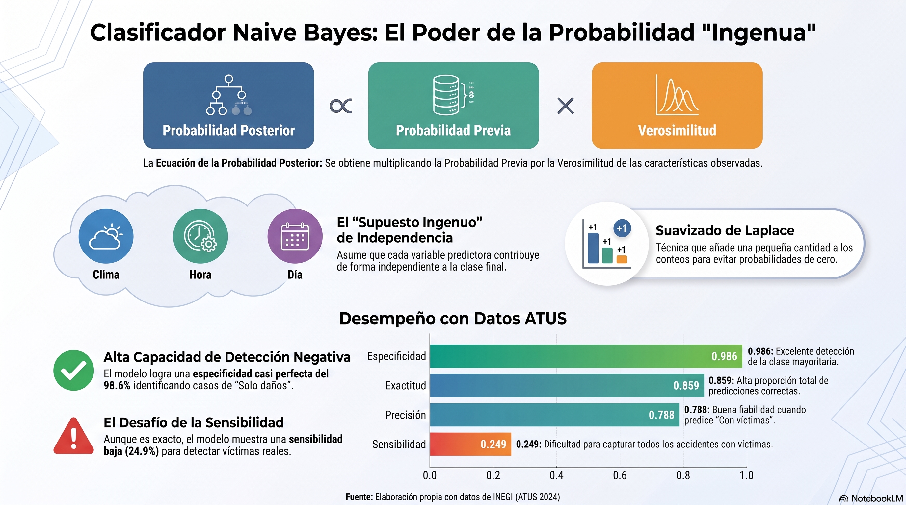

# Clasificador Naive Bayes

::: {.callout-note title="Conexión con el volumen teórico"}
La formulación matemática del teorema de Bayes, probabilidad condicional y clasificación probabilística se desarrolla con mayor profundidad en los capítulos 3 y 16 de *Fundamentos Matemáticos del Aprendizaje Automático* [@rodriguez2026fundamentos].
:::

## Objetivos del capítulo

Al finalizar este capítulo, el lector será capaz de:

- explicar la regla de Bayes aplicada a clasificación;
- distinguir probabilidades previas, verosimilitudes y probabilidades posteriores;
- comprender el supuesto de independencia condicional de Naive Bayes;
- aplicar suavizado de Laplace para evitar probabilidades categóricas iguales a cero;
- combinar predictores categóricos y numéricos;
- seleccionar el parámetro de suavizado sin utilizar la prueba final;
- evaluar el modelo con métricas sensibles al desbalance;
- interpretar con cautela las probabilidades posteriores cuando el muestreo modifica la prevalencia.

## Del teorema de Bayes al clasificador

Para una clase $C_k$ y una observación $\mathbf{x}$,

$$
P(C_k\mid \mathbf{x})=
\frac{P(\mathbf{x}\mid C_k)P(C_k)}{P(\mathbf{x})}.
$$

Como el denominador es común a todas las clases, la clasificación puede expresarse como

$$
\widehat C=\arg\max_k P(C_k)P(\mathbf{x}\mid C_k).
$$

Naive Bayes introduce el supuesto de independencia condicional de los predictores dada la clase:

$$
P(x_1,\ldots,x_p\mid C_k)
\approx
\prod_{j=1}^{p}P(x_j\mid C_k).
$$

Por tanto,

$$
\widehat C=\arg\max_k
P(C_k)\prod_{j=1}^{p}P(x_j\mid C_k).
$$

::: {.callout-tip title="Por qué puede funcionar aunque el supuesto sea ingenuo"}
El objetivo de clasificación es identificar la clase con mayor puntuación posterior. El modelo puede clasificar razonablemente aun cuando los predictores no sean realmente independientes, aunque las probabilidades posteriores pueden estar mal calibradas [@domingos1997optimality; @hand2001idiots].
:::

## Ejemplo manual

Supongamos que queremos decidir si un accidente pertenece a la clase **Con víctimas**. Sean dos evidencias: ocurre de noche y es fin de semana.

```{r nb-ejemplo-manual}
prior_victimas <- 0.35
prior_danos <- 0.65

p_noche_victimas <- 0.60
p_finsemana_victimas <- 0.55

p_noche_danos <- 0.30
p_finsemana_danos <- 0.25

score_victimas <-
  prior_victimas *
  p_noche_victimas *
  p_finsemana_victimas

score_danos <-
  prior_danos *
  p_noche_danos *
  p_finsemana_danos

posterior_victimas <- score_victimas / (score_victimas + score_danos)
posterior_danos <- score_danos / (score_victimas + score_danos)

c(
  `Con víctimas` = posterior_victimas,
  `Solo daños` = posterior_danos
)
```

::: {.callout-note title="Producto de muchas probabilidades"}
Con muchos predictores, los productos pueden volverse extremadamente pequeños. Las implementaciones prácticas suelen trabajar con logaritmos de las puntuaciones, ya que

$$
\log\left[P(C_k)\prod_jP(x_j\mid C_k)\right]
=
\log P(C_k)+\sum_j\log P(x_j\mid C_k).
$$

La clase que maximiza el producto también maximiza su logaritmo.
:::

## Suavizado de Laplace

Si una categoría nunca aparece en una clase durante entrenamiento, su probabilidad condicional empírica puede ser cero. El suavizado de Laplace evita que un solo cero anule todo el producto.

Para una variable categórica con $K$ categorías,

$$
\widehat P(X=x\mid C=c)=
\frac{n_{xc}+\alpha}{n_c+\alpha K}.
$$

- $\alpha=0$: sin suavizado;
- $\alpha=1$: suavizado de Laplace clásico;
- otros valores permiten una regularización intermedia o mayor.

## Predictores numéricos

En la variante gaussiana, un predictor continuo se modela dentro de cada clase mediante

$$
X_j\mid C_k\sim N(\mu_{jk},\sigma_{jk}^2).
$$

Así, Naive Bayes puede combinar factores y variables continuas. El supuesto gaussiano debe considerarse una aproximación; distribuciones muy asimétricas o con colas pesadas pueden requerir transformaciones u otras variantes del clasificador.

## Funciones auxiliares

```{r nb-funciones-auxiliares}
library(readr)
library(dplyr)
library(tidyr)
library(ggplot2)
library(e1071)
source("util_graficas.R")

partir_nb_estratificado <- function(
  y,
  prop_train = 0.60,
  prop_val = 0.20,
  semilla = 2026
) {
  set.seed(semilla)
  y <- factor(y)

  idx_train <- integer(0)
  idx_val <- integer(0)
  idx_test <- integer(0)

  for (clase in levels(y)) {
    ids <- sample(which(y == clase))
    n_train <- floor(prop_train * length(ids))
    n_val <- floor(prop_val * length(ids))

    ids_train <- ids[seq_len(n_train)]
    restantes <- ids[-seq_len(n_train)]
    ids_val <- restantes[seq_len(n_val)]
    ids_test <- setdiff(restantes, ids_val)

    idx_train <- c(idx_train, ids_train)
    idx_val <- c(idx_val, ids_val)
    idx_test <- c(idx_test, ids_test)
  }

  list(
    train = sort(idx_train),
    validation = sort(idx_val),
    test = sort(idx_test)
  )
}

metricas_nb <- function(real, predicho, positiva, negativa) {
  real <- factor(real, levels = c(negativa, positiva))
  predicho <- factor(predicho, levels = c(negativa, positiva))
  m <- table(Real = real, Predicho = predicho)

  VP <- m[positiva, positiva]
  FN <- m[positiva, negativa]
  FP <- m[negativa, positiva]
  VN <- m[negativa, negativa]

  div <- function(a, b) if (b == 0) NA_real_ else as.numeric(a / b)
  sensibilidad <- div(VP, VP + FN)
  especificidad <- div(VN, VN + FP)
  precision <- div(VP, VP + FP)
  f1 <- if (
    is.na(precision) || is.na(sensibilidad) ||
    precision + sensibilidad == 0
  ) {
    NA_real_
  } else {
    2 * precision * sensibilidad / (precision + sensibilidad)
  }

  list(
    matriz = m,
    metricas = data.frame(
      exactitud = div(VP + VN, sum(m)),
      sensibilidad = sensibilidad,
      especificidad = especificidad,
      precision = precision,
      f1 = f1,
      exactitud_balanceada = mean(c(sensibilidad, especificidad), na.rm = TRUE)
    )
  )
}
```

# Caso aplicado A: ATUS

## Cargar y preparar los datos

```{r nb-preparar-atus}
ruta_atus_ml <- "datos/atus_ml_preparado.csv"

if (!file.exists(ruta_atus_ml)) {
  stop("No se encontró datos/atus_ml_preparado.csv. Ejecute primero el capítulo 2.")
}

atus_ml <- read_csv(ruta_atus_ml, show_col_types = FALSE)

set.seed(2026)
atus_nb <- atus_ml |>
  mutate(
    accidente_con_victimas = factor(
      accidente_con_victimas,
      levels = c("Solo daños", "Con víctimas")
    ),
    MES = factor(MES),
    ID_HORA_NUM = suppressWarnings(as.numeric(ID_HORA)),
    ID_HORA_NUM = ifelse(
      ID_HORA_NUM >= 0 & ID_HORA_NUM <= 23,
      ID_HORA_NUM,
      NA_real_
    ),
    DIASEMANA = factor(DIASEMANA),
    TIPACCID = factor(TIPACCID),
    CAUSAACCI = factor(CAUSAACCI)
  ) |>
  drop_na(
    accidente_con_victimas,
    MES,
    ID_HORA_NUM,
    DIASEMANA,
    TIPACCID,
    CAUSAACCI
  ) |>
  slice_sample(n = min(12000, n()))

prop.table(table(atus_nb$accidente_con_victimas))
```

En este modelo `ID_HORA_NUM` se trata como predictor numérico gaussiano, mientras que mes, día de la semana, tipo y causa del accidente se tratan como factores.

## Entrenamiento, validación y prueba

```{r nb-particion-atus}
partes_atus <- partir_nb_estratificado(
  atus_nb$accidente_con_victimas,
  prop_train = 0.60,
  prop_val = 0.20,
  semilla = 2026
)

train_nb <- atus_nb[partes_atus$train, ]
val_nb <- atus_nb[partes_atus$validation, ]
test_nb <- atus_nb[partes_atus$test, ]

rbind(
  entrenamiento = prop.table(table(train_nb$accidente_con_victimas)),
  validacion = prop.table(table(val_nb$accidente_con_victimas)),
  prueba = prop.table(table(test_nb$accidente_con_victimas))
)
```

## Seleccionar el suavizado con validación

La prueba final no se utiliza para elegir $\alpha$.

```{r nb-validar-laplace-atus}
valores_laplace <- c(0, 0.5, 1, 2)

resultados_laplace <- do.call(
  rbind,
  lapply(valores_laplace, function(alpha) {
    modelo <- naiveBayes(
      accidente_con_victimas ~
        MES + ID_HORA_NUM + DIASEMANA + TIPACCID + CAUSAACCI,
      data = train_nb,
      laplace = alpha
    )

    pred <- predict(modelo, val_nb, type = "class")

    m <- metricas_nb(
      val_nb$accidente_con_victimas,
      pred,
      positiva = "Con víctimas",
      negativa = "Solo daños"
    )$metricas

    cbind(laplace = alpha, m)
  })
)

resultados_laplace

laplace_optimo <- resultados_laplace$laplace[
  which.max(resultados_laplace$exactitud_balanceada)
]

laplace_optimo
```

```{r nb-grafica-laplace, fig.width=7, fig.height=4.5}
resultados_laplace_largos <- resultados_laplace |>
  select(laplace, sensibilidad, especificidad, exactitud_balanceada) |>
  pivot_longer(
    cols = -laplace,
    names_to = "metrica",
    values_to = "valor"
  )

ggplot(
  resultados_laplace_largos,
  aes(x = factor(laplace), y = valor, fill = metrica)
) +
  geom_col(position = "dodge") +
  scale_y_continuous(limits = c(0, 1)) +
  labs(
    title = "Selección del suavizado de Naive Bayes",
    subtitle = "La decisión se toma con validación",
    x = "Parámetro de Laplace",
    y = "Métrica",
    fill = "Métrica"
  ) +
  tema_libro()
```

## Reentrenar y evaluar una sola vez

```{r nb-modelo-final-atus}
ref_nb <- bind_rows(train_nb, val_nb)

modelo_nb_final <- naiveBayes(
  accidente_con_victimas ~
    MES + ID_HORA_NUM + DIASEMANA + TIPACCID + CAUSAACCI,
  data = ref_nb,
  laplace = laplace_optimo
)

pred_nb_test <- predict(
  modelo_nb_final,
  test_nb,
  type = "class"
)

prob_nb_test <- predict(
  modelo_nb_final,
  test_nb,
  type = "raw"
)

resultado_nb_test <- metricas_nb(
  test_nb$accidente_con_victimas,
  pred_nb_test,
  positiva = "Con víctimas",
  negativa = "Solo daños"
)

resultado_nb_test$matriz
resultado_nb_test$metricas
head(prob_nb_test)
```

## Probabilidades previas y condicionales aprendidas

```{r nb-inspeccionar-modelo}
modelo_nb_final$apriori
modelo_nb_final$tables$MES
modelo_nb_final$tables$ID_HORA_NUM
```

La salida permite conectar el modelo ajustado con la teoría: `apriori` resume las frecuencias previas de clase; las tablas categóricas muestran probabilidades condicionales y los predictores numéricos se resumen mediante parámetros gaussianos por clase.

::: {.callout-warning title="Probabilidades posteriores y calibración"}
Las probabilidades de Naive Bayes no deben asumirse automáticamente calibradas. Además, si la muestra altera la prevalencia de clases, las probabilidades previas aprendidas también cambian y las posteriores dejan de representar directamente probabilidades poblacionales.
:::

## Distribución de la probabilidad posterior

```{r nb-probabilidades-grafica, fig.width=7, fig.height=4.5}
datos_prob_nb <- data.frame(
  probabilidad = prob_nb_test[, "Con víctimas"],
  clase_real = test_nb$accidente_con_victimas
)

ggplot(
  datos_prob_nb,
  aes(x = probabilidad, fill = clase_real)
) +
  geom_histogram(bins = 30, alpha = 0.65, position = "identity") +
  escala_clases_fill(name = "Clase real") +
  labs(
    title = "Probabilidades posteriores de Naive Bayes",
    x = "P(Con víctimas | predictores)",
    y = "Frecuencia"
  ) +
  tema_libro()
```

# Laboratorio interactivo: probabilidades posteriores

::: {.content-visible when-format="html"}
Modifique una probabilidad previa y dos verosimilitudes para observar el teorema de Bayes en acción.

```{shinylive-r}
#| standalone: true
#| viewerHeight: 700
#| components: [viewer]

library(shiny)

ui <- fluidPage(
  titlePanel("Calculadora Naive Bayes"),
  sidebarLayout(
    sidebarPanel(
      sliderInput("prior", "P(Clase 1)", 0.05, 0.95, 0.40, step = 0.05),
      sliderInput("e1", "P(Evidencia | Clase 1)", 0.01, 0.99, 0.80, step = 0.01),
      sliderInput("e0", "P(Evidencia | Clase 0)", 0.01, 0.99, 0.25, step = 0.01),
      radioButtons(
        "observada",
        "Evidencia observada",
        choices = c("Sí" = "si", "No" = "no")
      )
    ),
    mainPanel(
      tableOutput("calculo"),
      plotOutput("grafica", height = "340px"),
      textOutput("decision")
    )
  )
)

server <- function(input, output, session) {
  posterior <- reactive({
    p1 <- input$prior
    p0 <- 1 - p1

    if (input$observada == "si") {
      l1 <- input$e1
      l0 <- input$e0
    } else {
      l1 <- 1 - input$e1
      l0 <- 1 - input$e0
    }

    num1 <- p1 * l1
    num0 <- p0 * l0
    evidencia <- num1 + num0

    c(
      Clase_0 = num0 / evidencia,
      Clase_1 = num1 / evidencia
    )
  })

  output$calculo <- renderTable({
    p <- posterior()
    data.frame(
      Clase = names(p),
      Probabilidad_posterior = round(as.numeric(p), 4)
    )
  })

  output$grafica <- renderPlot({
    p <- posterior()
    barplot(
      p,
      ylim = c(0, 1),
      ylab = "Probabilidad posterior",
      main = "Resultado de Naive Bayes"
    )
    abline(h = 0.5, lty = 2)
  })

  output$decision <- renderText({
    p <- posterior()
    paste(
      "Clase predicha:",
      ifelse(p["Clase_1"] >= p["Clase_0"], "Clase 1", "Clase 0")
    )
  })
}

shinyApp(ui, server)
```
:::

::: {.content-visible when-format="pdf"}
### Laboratorio disponible en la versión web
Permite modificar probabilidades previas y condicionales y observar las probabilidades posteriores normalizadas.
:::

# Caso aplicado B: Naive Bayes con COVID-19

## Seleccionar el mismo periodo reproducible

```{r covid-nb-periodo}
conteo_covid <- read_csv(
  "datos/covid19/procesados/conteo_casos_confirmados_2020_2025.csv",
  show_col_types = FALSE
)

anio_covid <- conteo_covid |>
  filter(ESTADO == "PROCESADO", !is.na(CASOS_CONFIRMADOS)) |>
  slice_max(CASOS_CONFIRMADOS, n = 1, with_ties = FALSE) |>
  pull(ANIO)

ruta_covid <- file.path(
  "datos/covid19/procesados",
  paste0("covid19_mexico_", anio_covid, "_ml_preparado.csv.gz")
)

if (!file.exists(ruta_covid)) {
  stop("No se encontró la base COVID-19 seleccionada por el procedimiento reproducible.")
}
```

## Preparar la muestra

```{r covid-nb-preparar}
covid_nb <- read_csv(ruta_covid, show_col_types = FALSE) |>
  select(
    MURIO, EDAD, NEUMONIA, DIABETES, HIPERTENSION,
    OBESIDAD, RENAL_CRONICA, NUM_COMORBILIDADES
  ) |>
  drop_na() |>
  mutate(
    MURIO = factor(
      MURIO,
      levels = c(0, 1),
      labels = c("Sin defunción", "Defunción")
    ),
    NEUMONIA = factor(NEUMONIA),
    DIABETES = factor(DIABETES),
    HIPERTENSION = factor(HIPERTENSION),
    OBESIDAD = factor(OBESIDAD),
    RENAL_CRONICA = factor(RENAL_CRONICA)
  )

set.seed(2026)
covid_nb <- covid_nb |>
  slice_sample(n = min(12000, n()))

partes_covid <- partir_nb_estratificado(
  covid_nb$MURIO,
  prop_train = 0.60,
  prop_val = 0.20,
  semilla = 2026
)

covid_train <- covid_nb[partes_covid$train, ]
covid_val <- covid_nb[partes_covid$validation, ]
covid_test <- covid_nb[partes_covid$test, ]
```

::: {.callout-warning title="Uso exclusivamente educativo"}
Las probabilidades posteriores de este ejercicio describen el modelo ajustado sobre una muestra administrativa. No constituyen riesgo clínico individual ni una probabilidad poblacional automáticamente calibrada.
:::

## Seleccionar Laplace y evaluar

```{r covid-nb-validar}
resultados_covid_laplace <- do.call(
  rbind,
  lapply(c(0, 1, 2), function(alpha) {
    modelo <- naiveBayes(MURIO ~ ., data = covid_train, laplace = alpha)
    pred <- predict(modelo, covid_val, type = "class")

    m <- metricas_nb(
      covid_val$MURIO,
      pred,
      positiva = "Defunción",
      negativa = "Sin defunción"
    )$metricas

    cbind(laplace = alpha, m)
  })
)

resultados_covid_laplace

alpha_covid <- resultados_covid_laplace$laplace[
  which.max(resultados_covid_laplace$exactitud_balanceada)
]
```

```{r covid-nb-final}
covid_ref <- bind_rows(covid_train, covid_val)

modelo_nb_covid <- naiveBayes(
  MURIO ~ .,
  data = covid_ref,
  laplace = alpha_covid
)

pred_nb_covid <- predict(modelo_nb_covid, covid_test, type = "class")
prob_nb_covid <- predict(modelo_nb_covid, covid_test, type = "raw")

resultado_covid_nb <- metricas_nb(
  covid_test$MURIO,
  pred_nb_covid,
  positiva = "Defunción",
  negativa = "Sin defunción"
)

resultado_covid_nb$matriz
resultado_covid_nb$metricas
head(prob_nb_covid)
```

## Ventajas y limitaciones

### Ventajas

- entrenamiento rápido;
- conexión directa con probabilidad condicional y Bayes;
- admite predictores categóricos y continuos;
- funciona bien como línea base probabilística;
- puede manejar espacios de alta dimensión.

### Limitaciones

- independencia condicional suele ser una aproximación;
- predictores correlacionados pueden contar información repetida;
- las probabilidades pueden estar mal calibradas;
- categorías raras requieren suavizado;
- la variante gaussiana puede ser inadecuada para variables continuas muy asimétricas.

## Materiales complementarios del capítulo

| Recurso | Utilidad | Abrir o reproducir | Descargar |
|---|---|---|---|
| Video explicativo | Explicación audiovisual del clasificador Naive Bayes. | [Ver en YouTube](https://www.youtube.com/watch?v=UbfJ3bLDwUI){target="_blank"} | — |
| Presentación en PDF | Diapositivas para lectura, estudio o exposición. | [Ver PDF](recursos/capitulo-11/capitulo-11-naive-bayes-presentacion.pdf){target="_blank"} | [Descargar PDF](recursos/capitulo-11/capitulo-11-naive-bayes-presentacion.pdf){download="capitulo-11-naive-bayes-presentacion.pdf"} |
| Presentación editable | Archivo PowerPoint para utilizarlo en clase o adaptarlo. | [Abrir PPTX](recursos/capitulo-11/capitulo-11-naive-bayes-presentacion.pptx) | [Descargar PPTX](recursos/capitulo-11/capitulo-11-naive-bayes-presentacion.pptx){download="capitulo-11-naive-bayes-presentacion.pptx"} |
| Infografía | Resumen visual de las ideas fundamentales. | [Ver infografía](recursos/capitulo-11/capitulo-11-naive-bayes-infografia.png){target="_blank"} | [Descargar PNG](recursos/capitulo-11/capitulo-11-naive-bayes-infografia.png){download="capitulo-11-naive-bayes-infografia.png"} |
| Cuaderno Google Colab | Cuaderno autónomo para ejecutar los ejemplos del capítulo. | [Abrir en Google Colab](https://colab.research.google.com/github/gilbertorodriguez59/libro-machine-learning-r/blob/main/colab/11-naive-bayes.ipynb){target="_blank"} | — |

::: {.content-visible when-format="html"}
### Video explicativo

<div class="video-responsive">
  <iframe
    src="https://www.youtube.com/embed/UbfJ3bLDwUI"
    title="Capítulo 11. Naive Bayes"
    frameborder="0"
    allow="accelerometer; autoplay; clipboard-write; encrypted-media; gyroscope; picture-in-picture; web-share"
    referrerpolicy="strict-origin-when-cross-origin"
    allowfullscreen>
  </iframe>
</div>

### Vista previa de la infografía

[](recursos/capitulo-11/capitulo-11-naive-bayes-infografia.png)
:::

::: {.content-visible when-format="pdf"}
**Video del capítulo:** <https://www.youtube.com/watch?v=UbfJ3bLDwUI>

La presentación PDF, el archivo editable, la infografía y el cuaderno Colab pueden consultarse desde la versión web del libro.
:::

::: {.callout-note title="Elaboración de los materiales"}
Los materiales complementarios fueron elaborados con apoyo de **NotebookLM de Google**, a partir del contenido del capítulo, y posteriormente revisados y adaptados por el autor.
:::

## Actividades para el lector

1. Compare $\alpha=0$, $0.5$, $1$ y $2$ sin utilizar la prueba para elegir.
2. Elimine un predictor altamente relacionado con otro y observe el cambio.
3. Compare las probabilidades posteriores con las de regresión logística.
4. Examine qué categorías tienen probabilidades condicionales muy diferentes entre clases.
5. Explique por qué una muestra balanceada modifica los *priors* y la interpretación de las probabilidades posteriores.

## Conclusión

Naive Bayes convierte el teorema de Bayes en un clasificador rápido y transparente. Su supuesto de independencia simplifica el cálculo, pero no debe interpretarse como una descripción literal de la dependencia entre variables. El suavizado se selecciona con validación, la prueba queda reservada para el final y las probabilidades posteriores requieren especial cautela cuando el muestreo modifica la prevalencia.

## Referencias fundamentales

El análisis de las condiciones bajo las cuales Naive Bayes puede ser óptimo fue desarrollado por @domingos1997optimality. Una discusión crítica de su eficacia pese al supuesto ingenuo aparece en @hand2001idiots. Para una introducción moderna puede consultarse @james2021islr.
